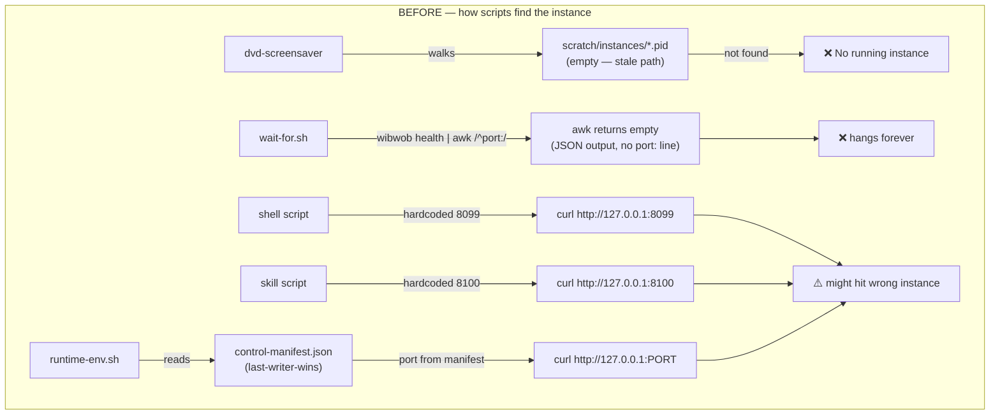
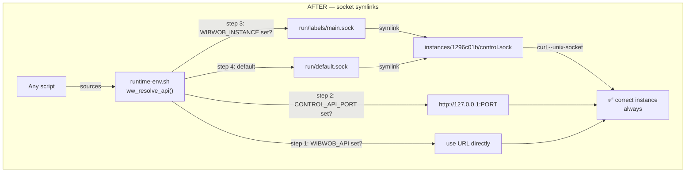

# Instance Management Design

> Spec for `chore/shell-instance-resolution`. Standalone handover — everything needed to implement is in this document.
>
> Created: 2026-03-25 · Platform: macOS + Linux

---

## Problem

48 shell scripts each guess how to find a running WibWob-DOS instance. Some hardcode port 8099. Some scan ports. Some read a stale manifest file. Some walk a directory that moved months ago. Three parse `wibwob health` output with awk in a way that broke when the output format changed to JSON.

With two instances running, scripts silently hit the wrong one — or hang, or fail with "not found."

The instance discovery logic that works correctly already exists in TypeScript (`src/cli/instance-discovery.ts`). It walks `.wibwob/instances/*/control.sock`, checks PIDs, resolves by label. But shell scripts can't import TypeScript, so they each re-implement a broken fragment.

---

## Affected scripts (48)

### Already sourcing `runtime-env.sh` — fix runtime-env.sh and these inherit it (8)

| Script | Notes |
|---|---|
| `scripts/lib/runtime-env.sh` | **the root fix** — reads stale manifest, falls back to 8099 |
| `scripts/minimap.sh` | sources runtime-env.sh |
| `scripts/reload-microapp.sh` | sources runtime-env.sh |
| `scripts/screenshot-window.sh` | sources runtime-env.sh |
| `scripts/testing/blocking-flow-check.sh` | sources runtime-env.sh |
| `scripts/testing/cli-parity-check.sh` | sources runtime-env.sh |
| `scripts/testing/live-api-test-suite.sh` | sources runtime-env.sh |
| `scripts/testing/runtime-parity-check.sh` | sources runtime-env.sh |

### Broken parse — actively failing with multi-instance (3)

| Script | Bug |
|---|---|
| `.pi/skills/ghostty-control/scripts/wait-for.sh` | `awk '/^port:/'` returns empty on JSON output → hangs |
| `.pi/skills/ghostty-control/scripts/calibrate.sh` | same awk bug → empty port |
| `.pi/skills/ghostty-control/scripts/restart-wibwob.sh` | same awk/grep bug |

### Stale path — `scratch/instances/` moved to `.wibwob/instances/` (4)

| Script | Notes |
|---|---|
| `scripts/experimental/dvd-screensaver.sh` | walks dead directory |
| `scripts/experimental/dvd-screensaver-v2.sh` | same |
| `scripts/experimental/dvd-screensaver-v3.sh` | partially fixed today, still fragile |
| `scripts/experimental/dvd-wib-to-wob.sh` | same |

### Hardcoded port — silently wrong on multi-instance (26)

| Script | Hardcoded to |
|---|---|
| `.pi/skills/wibwobdos-control/scripts/open.sh` | 8099 |
| `.pi/skills/wibwobdos-control/scripts/screenshot.sh` | 8099 |
| `.pi/skills/wibwobdos-control/scripts/state.sh` | 8099 |
| `.pi/skills/wibwobdos-control/scripts/send.sh` | 8099 |
| `.pi/skills/wibwobdos-control/scripts/export.sh` | 8099 |
| `.pi/skills/wibwobdos-control/scripts/discord.sh` | 8099 |
| `.pi/skills/wibwobdos-control/scripts/ghostty-shader.sh` | 8099 |
| `.pi/skills/wibwobdos-control/scripts/connect.sh` | 8099 |
| `.pi/skills/discord-tui-share/share.sh` | 8099 |
| `.pi/skills/wibwobdos-cinema/scripts/wibwob-record.sh` | 8099 |
| `.pi/skills/wibwobdos-cinema/scripts/example-choreography.sh` | 8099 |
| `.pi/skills/vj-timeline/scripts/replay-scpt.sh` | 8099 |
| `.pi/skills/vj-timeline/scripts/smear-animate.sh` | 8099 |
| `.pi/skills/wibwob-hosting-smoke/scripts/docker-vps-smoke.sh` | 8099 |
| `scripts/experimental/theme-rave.sh` | 8100 |
| `scripts/experimental/spell-storm.sh` | 8100 |
| `scripts/experimental/heartbeat.sh` | 8100 |
| `scripts/experimental/zine-flipbook.sh` | 8100 |
| `scripts/experimental/contour-drift.sh` | 8100 |
| `scripts/experimental/ghostty-menu-click-smoke.sh` | 8099 |
| `scripts/fx/diagonal-trail.sh` | 8099 |
| `scripts/coat-compliance.sh` | 8099 |
| `scripts/docker-smoke.sh` | 8099 |
| `scripts/lib/process-manager.sh` | 8099 |
| `scripts/testing/overlap-check.sh` | 8099 |
| `scripts/testing/layout-sweep.sh` | 8099 |
| `scripts/validate-deps.sh` | 8099 |
| `scripts/validate-microapp.sh` | 8099 |

### Other — reference ports but in context-appropriate ways (7)

| Script | Notes |
|---|---|
| `.pi/skills/ghostty-control/scripts/open-instance.sh` | polls 8099–8110 to find freshly spawned instance — intentional |
| `.pi/skills/wibwob-hosting-smoke/scripts/docker-human-view.sh` | deploy context, TCP correct |
| `.pi/skills/wibwob-hosting-smoke/scripts/fly-smoke.sh` | deploy context, TCP correct |
| `autoresearch.checks.sh` | lints for hardcoded ports — meta, not a consumer |
| `scripts/ghostty-capture.sh` | uses wibwob CLI, not direct port |
| `scripts/ghostty-send.sh` | uses wibwob CLI |
| `scripts/ghostty-window-id.sh` | uses wibwob CLI |
| `scripts/testing/ci-cli-test.sh` | CI context, `WW_API` env correct |

---

## TLDR

An instance is a unix socket, not a TCP port. On startup the socket is symlinked at well-known paths so any script can find it in O(1). TCP ports are for browsers and remote access only — local scripts never need them.

Prior art: `src/services/pi-session-bridge.ts` already uses `<name>.alias → socket` symlinks for pi session discovery. Same pattern.

---

## Before / After

### Before — how scripts find the instance



### After — socket symlinks



---

## Instance lifecycle (pseudo-code)

```
# ── STARTUP ──────────────────────────────────────────────────────────────
id       = uuid()
label    = env.WIBWOB_INSTANCE_LABEL | "instance-" + id[0:8]
dataRoot = env.WIBWOB_DATA_DIR | "$HOME/.wibwob"
root     = "$dataRoot/instances/$id"

mkdir_p(root)
mkdir_p("$dataRoot/run/labels")
write("$root/control.pid", pid)
socket   = bind_unix("$root/control.sock")
port     = bind_tcp(env.CONTROL_API_HOST, env.CONTROL_API_PORT | next_free_from(8099))

write("$root/discovery.json", {
  instanceId, label, port, host, socketPath: socket,
  startedAt, cwd, screen: {width, height}
})

# Symlink registration — ln -sf is atomic enough for this use case
ln_sf(socket, "$dataRoot/run/labels/$label.sock")
if not alive("$dataRoot/run/default.sock"):     # check liveness, not just existence
  ln_sf(socket, "$dataRoot/run/default.sock")

prune_dead(dataRoot)   # walk instances/, kill -0 each pid, unlink dead sockets

# ── SHUTDOWN ─────────────────────────────────────────────────────────────
unlink("$root/control.sock")
unlink("$root/control.pid")
unlink("$dataRoot/run/labels/$label.sock")

if readlink("$dataRoot/run/default.sock") == socket:
  next = first_alive_except(id, dataRoot)
  next ? ln_sf(next.socket, "$dataRoot/run/default.sock")
       : unlink("$dataRoot/run/default.sock")
```

---

## Per-environment table

| Environment | Label | Scripts find instance via | TCP port | Needs socket? |
|---|---|---|---|---|
| **Local — single** | auto | `run/default.sock` | incidental | ✓ |
| **Local — multi** | `WIBWOB_INSTANCE_LABEL=main` | `run/labels/main.sock` | incidental | ✓ |
| **Docker / Fly / Render** | `WIBWOB_INSTANCE_LABEL=fly` | `CONTROL_API_PORT` env → TCP | explicit | no |
| **VPS multi-tenant** | `WIBWOB_INSTANCE_LABEL=prod` | `run/labels/prod.sock` | behind proxy | ✓ |
| **CI headless** | `WIBWOB_INSTANCE_LABEL=ci` | `CONTROL_API_PORT` env → TCP | explicit | no |
| **Agent session** | inherits from shell | inherits `WIBWOB_INSTANCE` | inherits | ✓ |

---

## Shell resolution — `ww_resolve_api()`

Returns a socket path (`/…`) or an HTTP URL (`http://…`). Six steps, first match wins.

```bash
ww_resolve_api() {
  # 1. Full URL override (remote callers, deploy)
  [[ -n "${WIBWOB_API:-}" ]] && echo "$WIBWOB_API" && return

  # 2. Explicit port (deploy entrypoints set this)
  [[ -n "${CONTROL_API_PORT:-}" ]] && echo "http://127.0.0.1:${CONTROL_API_PORT}" && return

  local data="${WIBWOB_DATA_DIR:-$HOME/.wibwob}"

  # 3. Named instance — O(1) label symlink
  if [[ -n "${WIBWOB_INSTANCE:-}" ]]; then
    local sock="$data/run/labels/${WIBWOB_INSTANCE}.sock"
    [[ -S "$sock" ]] && echo "$sock" && return
  fi

  # 4. Default instance — O(1)
  local dsock="$data/run/default.sock"
  [[ -S "$dsock" ]] && echo "$dsock" && return

  # 5. Full scan — backward compat only, remove when all instances write symlinks
  for dir in "$data/instances"/*/; do
    local pid_f="$dir/control.pid" sock="$dir/control.sock"
    [[ -f "$pid_f" ]] || continue
    kill -0 "$(cat "$pid_f")" 2>/dev/null || continue
    [[ -S "$sock" ]] && echo "$sock" && return
  done

  # 6. TCP fallback — container without socket
  echo "http://127.0.0.1:${CONTROL_API_PORT:-8099}"
}
```

Callers check the return value: if it starts with `/`, use `curl --unix-socket "$api" http://localhost/path`. If it starts with `http`, use `curl "$api/path"`.

---

## What changes where

| What | Now (broken/duplicated) | After | Constant in `config.ts` |
|---|---|---|---|
| **Label symlinks** | don't exist | `run/labels/<label>.sock` → instance socket | `RUNTIME_LABELS_DIR` |
| **Default symlink** | doesn't exist | `run/default.sock` → first alive socket | `RUNTIME_DEFAULT_SOCK` |
| **Socket filename** | `"control.sock"` in 4 TS files | imported from `config.ts` | `INSTANCE_SOCKET_FILE` |
| **PID filename** | `"control.pid"` in 4 TS files | imported from `config.ts` | `INSTANCE_PID_FILE` |
| **Discovery filename** | `"discovery.json"` in 3 TS files | imported from `config.ts` | `INSTANCE_DISCOVERY_FILE` |
| **Run directory** | doesn't exist | `$DATA_ROOT/run/` | `RUNTIME_DIR` |
| **Manifest** | `control-manifest.json` (last-writer-wins) | deprecated → `default.sock` replaces it | remove |
| **runtime-env.sh** | reads stale manifest, falls back to 8099 | `ww_resolve_api()` 6-step chain | — |
| **48 shell scripts** | hardcoded ports or stale paths | source `runtime-env.sh` | — |

---

## User stories

### 1 · Developer — two instances, just works

You run `bun run dev`, then spawn a second instance. You run `bash scripts/minimap.sh` without thinking. It shows the right desktop — `run/default.sock` points to the first alive instance. To target the other one: `WIBWOB_INSTANCE=c37 bash scripts/minimap.sh`. That's the whole API.

### 2 · Agent — no orientation

Agent drops into a session. Runs a skill script. The script finds the right instance. If the human launched the agent inside `wibwob -i main tui`, the shell has `WIBWOB_INSTANCE=main`. Every script inherits it. No coordination needed.

### 3 · "What's running?"

```bash
ls ~/.wibwob/run/labels/
# main.sock  c37.sock
```

Two alive instances, by name. No PID archaeology.

### 4 · Deploy — one thing to set

Fly.io: `CONTROL_API_PORT=8099`. VPS: give instances labels, target by name. New deploy target in six months: set a label or a port. Nothing else changes.

### 5 · Crash restart — nothing breaks

Instance crashes, restarts on port 8100. `run/default.sock` is rewritten pointing to the new socket. Scripts using the socket never knew there was a port.

---

## Implementation steps

### Phase 1 — Constants (no behaviour change)
- [ ] Export `INSTANCE_SOCKET_FILE`, `INSTANCE_PID_FILE`, `INSTANCE_DISCOVERY_FILE`, `RUNTIME_DIR`, `RUNTIME_LABELS_DIR`, `RUNTIME_DEFAULT_SOCK` from `config.ts`
- [ ] Update `app-controller.ts`, `control-api.ts`, `instance-discovery.ts`, `wibwob.ts` to import
- [ ] `bun run typecheck` — green

### Phase 2 — Symlink writes (the structural fix)
- [ ] On bind in `control-api.ts`: `mkdirSync(RUNTIME_LABELS_DIR)`, symlink label + default
- [ ] On shutdown: remove label symlink, rotate default to next alive
- [ ] Evidence: `ls -la ~/.wibwob/run/labels/` shows live symlinks after `bun run dev`

### Phase 3 — Shell layer
- [ ] Rewrite `runtime-env.sh` with `ww_resolve_api()` 6-step chain
- [ ] Fix 3 broken-parse scripts (wait-for, calibrate, restart-wibwob): awk → json parse
- [ ] Fix 26 hardcoded-port scripts: source runtime-env.sh
- [ ] Fix 4 stale-path scripts: source runtime-env.sh
- [ ] Evidence: `WIBWOB_INSTANCE=main bash arrange.sh golden` targets correct instance

### Phase 4 — Deprecate manifest
- [ ] Stop writing `control-manifest.json`
- [ ] Remove manifest reads from `runtime-env.sh` and `instance-discovery.ts`

---

## Constraints

- `DATA_ROOT` must be local filesystem — unix sockets fail on NFS
- `ln -sf` is atomic enough for this use case (race window is sub-millisecond)
- Startup pruning is O(instance_count) — fine at ~55 dirs
- `$WIBWOB_DATA_DIR` in shell = `DATA_ROOT` in TypeScript — same env var, same logic
- Socket path length: longest path is ~52 bytes, well under macOS 104-byte / Linux 108-byte limits
- POSIX compatible: `ln -sf`, `kill -0`, `readlink` (no `-f`), `mkdir -p` — works on macOS + Linux
- `curl --unix-socket` requires curl 7.40+ (2014) — ships with macOS and all modern Linux distros
- Deploy containers use TCP (steps 1–2), never touch sockets — no curl version concern there
