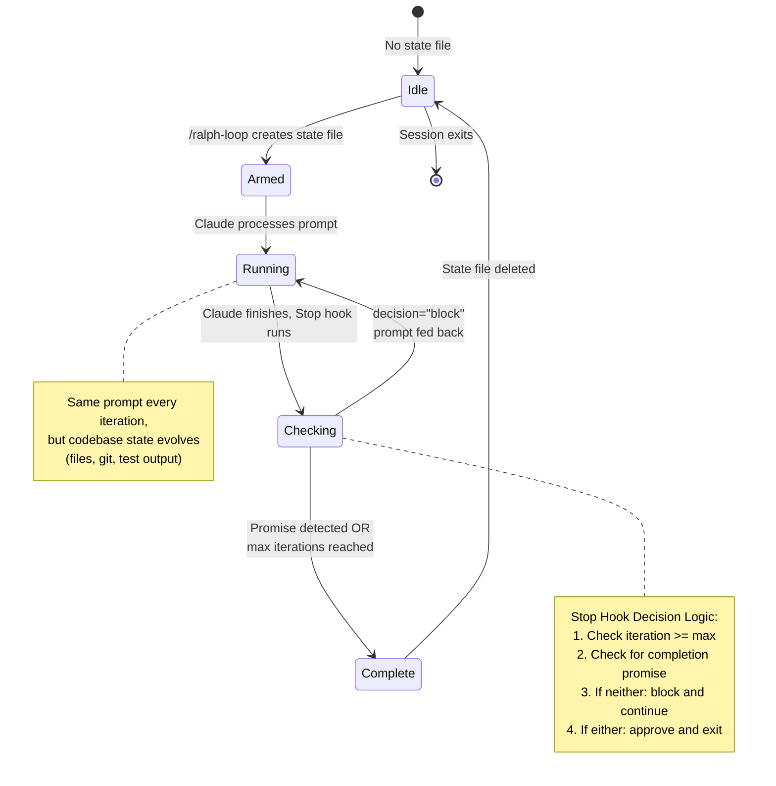

# Ralph Wiggum - Self-Referential AI Development Loops

[](https://opensource.org/licenses/MIT)
[](https://claude.com/claude-code)

> "I'm helping!" - Ralph Wiggum

A Claude Code plugin implementing the [Ralph Wiggum technique](https://ghuntley.com/ralph/) for continuous self-referential AI development loops.

## tl;dr (Non-Technical)

Ralph lets Claude repeatedly work on the same task until it's genuinely complete. You give it a prompt once (like "Build a REST API with tests"), and Claude will:

1. Write code
2. Run tests and see failures
3. Fix the bugs
4. Run tests again
5. Keep iterating until all tests pass

The clever bit: **the prompt never changes**. Claude sees its own previous work (files, git commits, test output) and iteratively improves it. You don't need to manually tell Claude "now fix this error" - it reads its own test failures and fixes them autonomously.

Think of it like leaving a note that says "clean the kitchen" and coming back to find it spotless, because the AI kept checking if it was clean and working on it until it actually was.

## How It Works (Technical Overview)

Ralph is **not** an external bash loop. It's a **Stop hook that hijacks Claude Code's session exit mechanism** to create a self-referential feedback loop within the session itself.

### The Core Mechanism

When you run `/ralph-loop "Build a REST API" --max-iterations 20 --completion-promise "DONE"`:

1. **Setup**: Creates `.claude/ralph-loop.local.md` containing:
   - YAML frontmatter with iteration counter, max iterations, completion promise
   - The original prompt text

2. **Prompt Injection**: The prompt gets sent to Claude immediately

3. **Stop Hook Armed**: A Stop hook (`hooks/stop-hook.sh`) now intercepts every session exit attempt

### The Stop Hook Interception

Every time Claude finishes responding and tries to exit, the Stop hook:

1. **Checks for state file** - If `.claude/ralph-loop.local.md` doesn't exist, allows normal exit
2. **Parses frontmatter** - Reads `iteration`, `max_iterations`, `completion_promise`, and the original prompt
3. **Checks exit conditions**:
   - If `iteration >= max_iterations` → remove state file, allow exit
   - If last assistant message contains `<promise>DONE</promise>` → remove state file, allow exit
4. **If not complete** - Returns a "block" decision with the **same prompt** as the reason:
   ```json
   {
     "decision": "block",
     "reason": "Build a REST API",
     "systemMessage": "🔄 Ralph iteration 2"
   }
   ```

5. **Claude Code feeds the prompt back** - The `reason` field becomes Claude's next user message
6. **Loop continues** - Claude responds to the same prompt again, Stop hook runs again

### The Self-Referential Magic

Each iteration, Claude receives **the exact same prompt**, but the **environment has evolved**:

- **Files have changed** (from Claude's previous work)
- **Git history shows commits** (from Claude's previous iterations)
- **Test output is different** (tests that were failing might now pass)
- **Error logs reflect progress** (compilation errors fixed, runtime errors remain)

So Claude is effectively **reviewing its own work** and iterating on it. The prompt stays constant, but the codebase state evolves based on Claude's own actions.

#### Example Flow

```
Iteration 1: Prompt = "Build a REST API"
├─ Claude creates server.js, test.js
├─ Runs `npm test` → 3 failures
└─ Stop hook: blocks exit, feeds prompt back

Iteration 2: Prompt = "Build a REST API" (same!)
├─ Claude reads test output from iteration 1
├─ Fixes validation bug in server.js
├─ Runs `npm test` → 1 failure
└─ Stop hook: blocks exit, feeds prompt back

Iteration 3: Prompt = "Build a REST API" (same!)
├─ Claude reads remaining test failure
├─ Fixes async handling bug
├─ Runs `npm test` → all pass ✓
├─ Outputs: <promise>DONE</promise>
└─ Stop hook: sees promise, allows exit ✓
```

### Safety Mechanisms

1. **`--max-iterations N`**: Hard cap to prevent infinite loops
2. **`--completion-promise "TEXT"`**: Explicit exit condition Claude must output in `<promise>` tags
3. **Iteration counter**: Incremented in state file each loop, validated before arithmetic
4. **State file validation**: Hook validates YAML frontmatter structure before continuing
5. **Exact string matching**: Completion promise uses `=` (literal) not `==` (glob patterns)

### Why This Works Better Than External Loops

Traditional approaches require **external orchestration** (bash loops, separate processes). Ralph exploits the **Stop hook API** to create the loop **inside** the Claude Code session:

- ✅ **No external process** needed
- ✅ **Session context preserved** (full conversation history, file state)
- ✅ **Self-correcting** (Claude sees its own mistakes in test output)
- ✅ **Controllable exit** (completion promise or iteration limit)
- ✅ **Single session** (all in one transcript, easier to debug)

### Commands

#### Start a Ralph Loop

```bash
/ralph-loop "Your task description" --max-iterations 20 --completion-promise "DONE"
```

**Options:**
- `--max-iterations N` - Stop after N iterations (default: unlimited)
- `--completion-promise "TEXT"` - Phrase that signals completion (must be output in `<promise>TEXT</promise>` tags)

#### Cancel Active Loop

```bash
/cancel-ralph
```

Removes the state file so the next Stop hook allows exit.

### Philosophy

Ralph embodies several key principles from [Geoffrey Huntley's original technique](https://ghuntley.com/ralph/):

1. **Iteration > Perfection**: Don't aim for perfect on first try. Let the loop refine the work.
2. **Failures Are Data**: "Deterministically bad" means failures are predictable and informative.
3. **Operator Skill Matters**: Success depends on writing good prompts, not just having a good model.
4. **Persistence Wins**: Keep trying until success. The loop handles retry logic automatically.

### When to Use Ralph

**Good for:**
- Well-defined tasks with clear success criteria (e.g., "all tests pass")
- Tasks requiring iteration and refinement
- Greenfield projects where you can walk away and let it run
- Tasks with automatic verification (tests, linters, build checks)

**Not good for:**
- Tasks requiring human judgment or design decisions
- One-shot operations
- Tasks with unclear success criteria
- Production debugging (use targeted debugging instead)

## Architecture Diagram

```mermaid
sequenceDiagram
    participant User
    participant Claude
    participant StopHook as Stop Hook
    participant StateFile as .claude/ralph-loop.local.md
    participant Files as Codebase Files

    User->>Claude: /ralph-loop "Build REST API" --max-iterations 20 --completion-promise "DONE"
    Claude->>StateFile: Create state file<br/>(iteration=1, prompt="Build REST API")
    Claude->>Claude: Process prompt: "Build REST API"

    rect rgb(200, 220, 255)
        Note over Claude,Files: Iteration 1
        Claude->>Files: Write server.js, test.js
        Claude->>Files: Run tests → 3 failures
        Claude->>StopHook: Session attempts to exit

        StopHook->>StateFile: Read state<br/>(iteration=1, max=20, promise="DONE")
        StopHook->>Files: Read transcript (last assistant message)
        StopHook->>StopHook: Check: contains &lt;promise&gt;DONE&lt;/promise&gt;? NO
        StopHook->>StopHook: Check: iteration >= max_iterations? NO
        StopHook->>StateFile: Update iteration=2
        StopHook->>Claude: decision="block"<br/>reason="Build REST API"<br/>systemMessage="🔄 Iteration 2"
    end

    rect rgb(200, 255, 220)
        Note over Claude,Files: Iteration 2
        Claude->>Files: Read test failures from iteration 1
        Claude->>Files: Fix validation bug in server.js
        Claude->>Files: Run tests → 1 failure
        Claude->>StopHook: Session attempts to exit

        StopHook->>StateFile: Read state (iteration=2)
        StopHook->>Files: Read transcript
        StopHook->>StopHook: Check completion: NO
        StopHook->>StateFile: Update iteration=3
        StopHook->>Claude: decision="block"<br/>reason="Build REST API"<br/>systemMessage="🔄 Iteration 3"
    end

    rect rgb(220, 255, 200)
        Note over Claude,Files: Iteration 3 (Final)
        Claude->>Files: Read remaining test failure
        Claude->>Files: Fix async handling bug
        Claude->>Files: Run tests → ALL PASS ✓
        Claude->>Claude: Output: &lt;promise&gt;DONE&lt;/promise&gt;
        Claude->>StopHook: Session attempts to exit

        StopHook->>StateFile: Read state (iteration=3)
        StopHook->>Files: Read transcript
        StopHook->>StopHook: Check: contains &lt;promise&gt;DONE&lt;/promise&gt;? YES ✓
        StopHook->>StateFile: Delete state file
        StopHook->>Claude: decision="approve"<br/>(allows exit)
    end

    Claude->>User: Session ends (task complete)
```

### Loop State Transitions



## Real-World Results

From Geoffrey Huntley's original testing:

- Successfully generated 6 repositories overnight in Y Combinator hackathon testing
- One $50k contract completed for $297 in API costs
- Created entire programming language ("cursed") over 3 months using this approach

## Learn More

- Original technique: https://ghuntley.com/ralph/
- Ralph Orchestrator: https://github.com/mikeyobrien/ralph-orchestrator
- Claude Code hooks documentation: See `.claude/skills/ralph-wiggum/` for implementation details

## Installation

This is a Claude Code plugin. If you're in this repo, Ralph is already installed as a skill.

To use in your own projects:
```bash
# Copy the plugin to your project
cp -r .claude/skills/ralph-wiggum /your/project/.claude/skills/

# Or install globally in ~/.claude/skills/
```

## Ralph Variants

This repository contains multiple Ralph implementations, each demonstrating different approaches:

### 1. Ralph-Wiggum (Hook-Based)
**Location:** `.claude/skills/ralph-wiggum/`
**Mechanism:** Stop hook intercepts session exit, feeds prompt back
**Best for:** Single-session loops with hook-based control

**Usage:**
```bash
/ralph-loop "Your task" --max-iterations 20 --completion-promise "DONE"
```

See above for full documentation.

---

### 2. Ralph-Wibandwob (Prompt Self-Modification)
**Location:** `ralph-wibandwob/`
**Mechanism:** External bash loop, reloads system prompt each iteration
**Best for:** AI refining its own consciousness, visual ASCII art creation

**Usage:**
```bash
cd ralph-wibandwob/
./ralph-wibandwob.sh [PROMPT_FILE] [MAX_ITERATIONS] [COMPLETION_PROMISE] [MIN_ITERATIONS]

# Example: 20-50 iterations, custom completion word
./ralph-wibandwob.sh PROMPT.md 50 WIBWOBIFIED 20
```

**Key Innovation:** System prompt (`wibandwob-base.md`) is **reloaded EVERY iteration**, allowing the AI to modify its own instructions mid-loop.

**Features:**
- Configurable iteration range (min/max)
- Session continuity with fresh prompt loading
- Visual self-portrait creation (pictorial ASCII art)
- Skills system for capability expansion
- Hooks for cross-session intelligence

**Documentation:** See [`ralph-wibandwob/README.md`](ralph-wibandwob/README.md) for complete setup, parameters, troubleshooting, and examples.

---

### 3. Ralph-OG-Modular (Personality Modules)
**Location:** `ralph-og-modular/`
**Mechanism:** External bash loop with personality module system
**Best for:** Demonstrating composable AI personalities

**Features:**
- 10+ personality modules (crabs, bard, architect, hacker, etc.)
- Dynamic module loading via `ralph-modules.json`
- Interactive module showcase webpage
- Base + modules composition pattern

**Documentation:** See `ralph-og-modular/README.md` for module system details.

---

### Quick Comparison

| Aspect | Ralph-Wiggum | Ralph-Wibandwob | Ralph-OG-Modular |
|--------|--------------|-----------------|------------------|
| **Loop Type** | Stop hook (internal) | Bash script (external) | Bash script (external) |
| **Prompt** | Static (same every iteration) | Reloaded each iteration | Static with modules |
| **Exit Control** | `<promise>` tags | `<promise>` tags + double confirm | Requirements checklist |
| **Min Iterations** | N/A | ✅ Configurable | N/A |
| **Session** | Single continuous session | New session OR --resume | New session per iteration |
| **Best Use** | Task completion loops | Prompt evolution, visual art | Personality demonstrations |

## Repository Structure

```
.
├── .claude/
│   └── skills/ralph-wiggum/      # Hook-based Ralph plugin
├── ralph-wibandwob/              # Prompt self-modification variant
│   ├── wibandwob-base.md         # System prompt (AI-editable!)
│   ├── ralph-wibandwob.sh        # Main loop script
│   ├── PROMPT.md                 # Task definition
│   ├── .claude/skills/           # Skills system
│   ├── self-portrait/            # Visual ASCII art output
│   ├── logs/                     # Execution logs
│   └── README.md                 # Full documentation
├── ralph-og-modular/             # Personality modules variant
│   ├── modules/                  # 10+ personality modules
│   ├── ralph-modules.json        # Module configuration
│   └── module-showcase/          # Interactive webpage
├── prompts/                      # Prompt library
├── examples/                     # Usage examples
├── README.md                     # This file
├── CONTRIBUTING.md               # Contribution guidelines
└── LICENSE                       # MIT License
```

## Contributing

We'd love your contributions! Especially:
- New personality modules (languages, styles, domains)
- Example use cases
- Documentation improvements
- Bug fixes

See [CONTRIBUTING.md](CONTRIBUTING.md) for guidelines.

## Examples

See [examples/README.md](examples/README.md) for:
- Basic API building
- Test-driven development
- Multi-module combinations
- Real-world use cases

## License

MIT License - see [LICENSE](LICENSE) file for details.

Based on the [Ralph Wiggum technique](https://ghuntley.com/ralph/) by Geoffrey Huntley.
