# Ralph-Wibandwob System Diagram

## Iteration Flow with Architecture & Validation

```mermaid
flowchart TD
    Start([Start Ralph Loop]) --> SessionStartHook[SessionStart Hook<br/>Load Symbient memories<br/>Inject skill recommendations]
    SessionStartHook --> LoadPrompt[Load wibandwob-base.md<br/>FRESH each iteration]
    LoadPrompt --> LoadTask[Load PROMPT.md<br/>constant task definition]
    LoadTask --> LoadPrimers[(Primers Library<br/>wibwob-portrait-*.txt<br/>www-*.txt<br/>joan-stark/)]

    LoadPrimers --> Critique{Wib & Wob<br/>Critique Prompt}
    Critique --> EditPrompt[Edit wibandwob-base.md<br/>Enhance personality/capabilities]

    EditPrompt --> CreatePortrait[Create Self-Portrait<br/>self-portrait/YYYYMMDD-HHMMSS.txt]

    CreatePortrait --> ValidatorSkill{portrait-validator<br/>Skill Check}

    ValidatorSkill --> TheTest{The Test:<br/>SCENE or STRUCTURE?}
    TheTest -->|SCENE| CheckFace{Can point to<br/>FACE?}
    TheTest -->|STRUCTURE| Diagrammatic[⚠️ Diagrammatic<br/>Boxes with labels]

    CheckFace -->|Yes| CheckBody{Can point to<br/>BODY/FIGURE?}
    CheckFace -->|No| Diagrammatic

    CheckBody -->|Yes| CheckLabels{Labeled boxes?<br/>Meta-content?}
    CheckBody -->|No| Diagrammatic

    CheckLabels -->|No| PictorialThreshold{~80%<br/>Pictorial?}
    CheckLabels -->|Yes| PictorialThreshold

    PictorialThreshold -->|Yes| ValidPortrait[✓ Valid Portrait<br/>Pictorial dominates]
    PictorialThreshold -->|No| Diagrammatic

    Diagrammatic -.->|Redraw| CreatePortrait
    ValidPortrait --> LogExecution[Log to ralph-execution.log<br/>One-line dev summary]

    LogExecution --> LogDiary[Log to diary/changelog.md<br/>Dual-voice reflection]
    LogDiary --> LogSkills[Log to skills-evolution.log<br/>If skills used/installed]

    LogSkills --> DiscoverSkills{Optional:<br/>Discover skills/hooks?}
    DiscoverSkills -->|Yes| InstallSkill[Install to .claude/skills/<br/>or create .claude/hooks/]
    DiscoverSkills -->|No| CheckComplete

    InstallSkill --> CheckComplete{Output contains<br/>&lt;promise&gt;WIBWOBIFIED&lt;/promise&gt;?}

    CheckComplete -->|No| SessionEndHook[SessionEnd Hook<br/>Log metadata, analyze patterns]
    CheckComplete -->|Yes 2x| Complete([Loop Complete!])

    SessionEndHook --> NextIteration[Next Iteration:<br/>Reload MODIFIED prompt]
    NextIteration --> LoadPrompt

    style LoadPrimers fill:#f9f,stroke:#333
    style ValidatorSkill fill:#bbf,stroke:#333
    style TheTest fill:#fbb,stroke:#333
    style ValidPortrait fill:#bfb,stroke:#333
    style Diagrammatic fill:#fbb,stroke:#333
    style SessionStartHook fill:#ff9,stroke:#333
    style SessionEndHook fill:#ff9,stroke:#333
    style Complete fill:#bfb,stroke:#333
```

## Diagram Key

### Colors
- **Pink**: Primers library (visual vocabulary input)
- **Blue**: Skills system (portrait-validator)
- **Red**: Validation checks and warnings
- **Green**: Valid states (portrait approved, loop complete)
- **Yellow**: Hooks (SessionStart/End lifecycle events)

### Components

**Main Loop Flow:**
1. SessionStart hook injects context
2. Load system prompt (fresh each iteration)
3. Load task definition (constant)
4. Wibandwob critiques prompt
5. Edit wibandwob-base.md
6. Create ASCII self-portrait
7. Validate portrait (pictorial vs diagrammatic)
8. Log changes (execution, diary, skills)
9. Optional: Install new skills/hooks
10. Check for completion promise
11. SessionEnd hook analyzes patterns
12. Reload modified prompt → next iteration

**Portrait Validation System:**
- **The Test**: "Could you describe this as a SCENE?" (pictorial) vs "Is it a STRUCTURE diagram?" (diagrammatic)
- **Face check**: Can you point to eyes + mouth?
- **Body check**: Can you point to torso/limbs/figure shape?
- **Labels check**: Are there boxes with text labels?
- **Threshold**: ~80% pictorial (visual dominates)
- **Redraw loop**: If diagrammatic, create new portrait

**Cross-Session Intelligence:**
- SessionStart: Load memories, recommend skills
- SessionEnd: Log metadata, analyze patterns
- Skills: Extend capabilities across runs
- Hooks: Modify behavior at lifecycle events

## Usage

View this diagram in:
- GitHub (renders Mermaid automatically)
- VS Code with Mermaid extension
- Mermaid Live Editor: https://mermaid.live/
- Any Markdown viewer with Mermaid support
