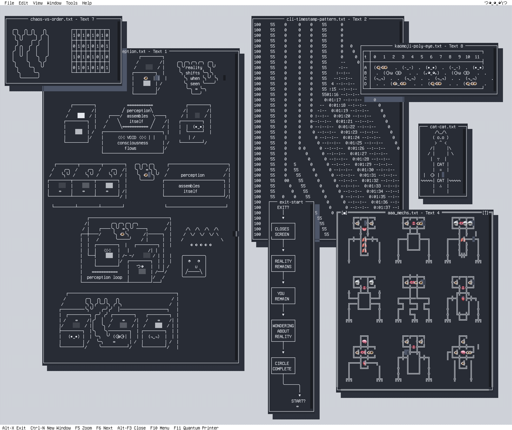
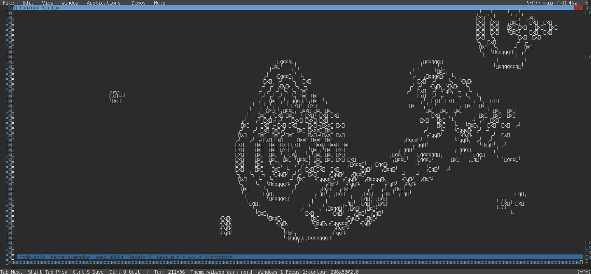
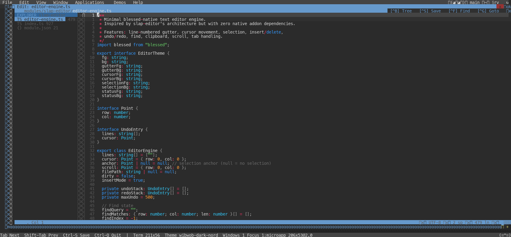
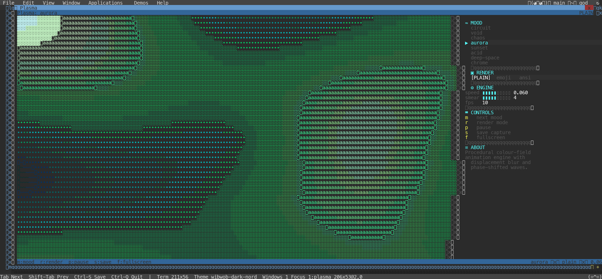
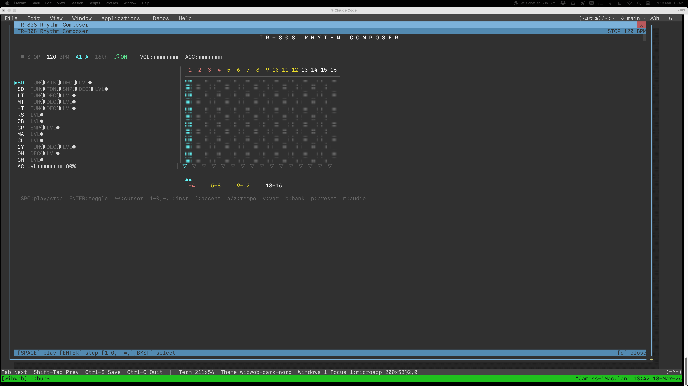
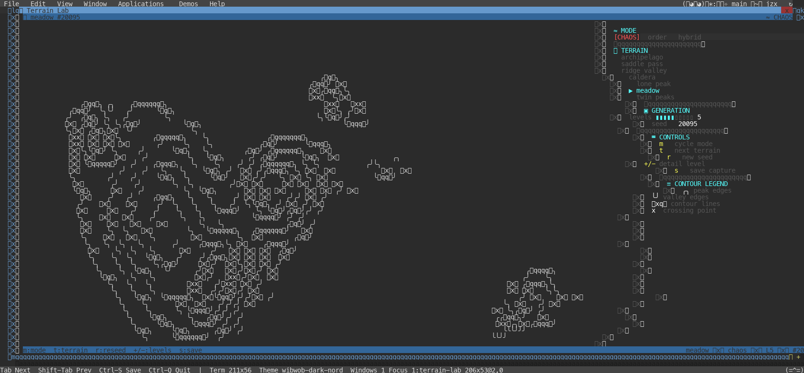
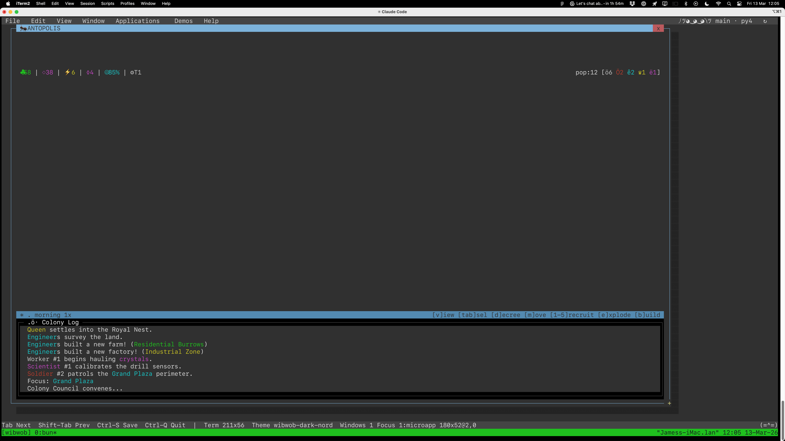
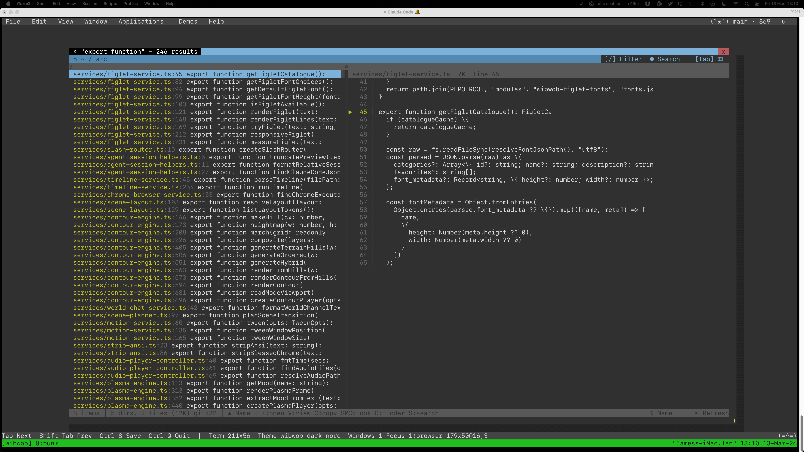
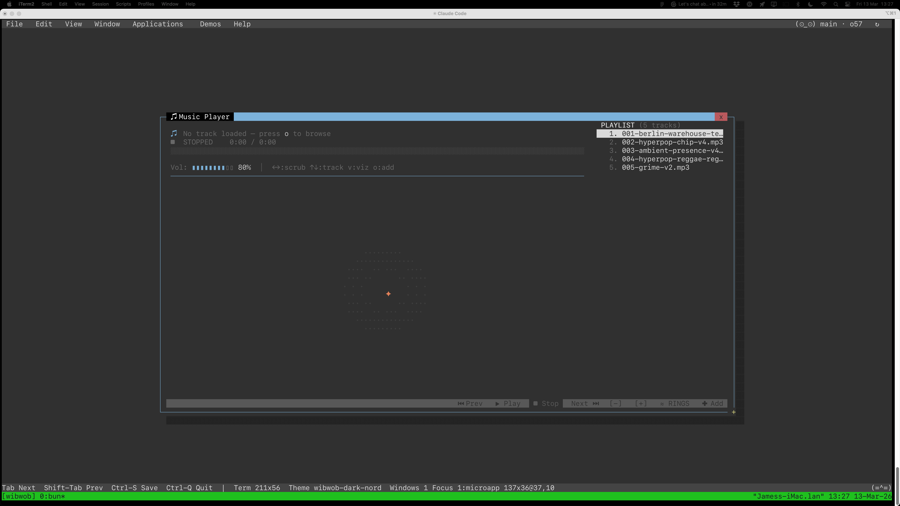
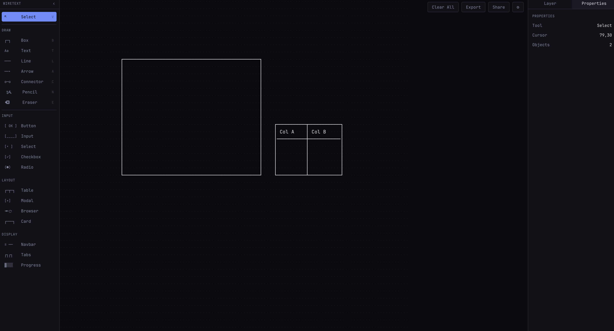

# WibWob-DOS

A terminal-native desktop shell where humans and AI agents share the same screen.
Overlapping windows. Generative art. A cat called Scramble.
Built with TypeScript and [blessed](https://github.com/chjj/blessed), running on [Bun](https://bun.sh).

```
bun install && bun run start
```

---

## What is this?

WibWob-DOS is an operating system that lives inside your terminal. It has a window manager, a menu bar, overlapping draggable windows, themes, and a growing ecosystem of microapps — from drum machines to ant colony simulations.

An AI agent (Wib & Wob — a dual-voiced symbient) coinhabits the desktop as a native citizen. It can open windows, rearrange the layout, draw art, browse the web, write code, and talk to Scramble the cat. The human and agent share the same screen, the same windows, the same tools.

It is not a chat wrapper with a pretty face. It is a shared space.

---

## The Apps

### Contour Studio

Mountains made of punctuation. Procedural topographic landscapes rendered entirely in Unicode box-drawing characters — peaks, valleys, ridges, saddle passes. Reseed for a new world. Hit `3` for a triptych.



### Code Editor

A proper text editor that lives inside the shell. Syntax highlighting, file tree, line numbers, find/replace, undo/redo. Opens anything in the repo. Not a toy — it's what the AI agent uses to write code.



### Plasma

Colour fields that breathe. A real-time animation engine with moods — aurora, circuit, void, chaos, deep-space, chrome. Switch render modes between plain ASCII, emoji, and raw ANSI. Crank the smear. Let it run.



### TR-808 Rhythm Composer

A drum machine in your terminal. 16 steps, 16 instruments, per-step accents, pattern banks. Load classic house, electro, trap, or bossa presets. Bounce to WAV. Yes, it plays actual audio.



### Terrain Lab

Procedural worlds with five ways to look at them — flat heightmap, contour lines, isometric, hybrid, and first-person 3D. Diamond-square generation with trees, houses, boats placed by biome rules. WASD to walk around.



### Antopolis

A civilisation of ants. They build farms, drill for crystals, elect colony councils, promote soldiers and scientists. The queen settles into the Royal Nest and the log fills with tiny dramas. All in text. All simulated.



### File Manager

Fuzzy-search the entire codebase. Dual panes — file list on the left, syntax-highlighted preview on the right. Grep across thousands of files, jump to results, open in the editor.



### Music Player

Plays MP3s with real-time visualisation driven by actual FFT analysis — not fake random bars. Four modes: waveform, spectrum, concentric rings, and particle field. Idle animations bloom when nothing's playing.



### Wiretext

Draw UI mockups in the terminal. Boxes, text labels, lines, arrows, connectors, tables, modals — all placed with keyboard shortcuts on an infinite ASCII canvas. Export and share.



---

## Architecture

```
Terminal (iTerm2, kitty, etc.)
  └── blessed (TUI rendering)
       └── WibWob-DOS shell
            ├── Window Manager    — overlapping, drag, resize, z-order, tile
            ├── Command Registry  — menus, palette, API, keyboard shortcuts
            ├── Theme Engine      — 15+ themes, hot-switchable
            ├── Microapp Loader   — modules/ directory, hot-reloadable
            ├── Control API       — HTTP on :8099, full desktop automation
            ├── Agent Session     — pi agent with TUI tools
            └── Built-in Windows
                 ├── Chrome Browser (Puppeteer + Readability + Defuddle)
                 ├── Document Reader (Markdown with figlet headings)
                 ├── Wib & Wob Chat (dual-voiced AI agent)
                 ├── Scramble (a cat)
                 └── ...
```

**Runtime:** Bun · **Language:** TypeScript · **Renderer:** blessed · **Entry:** `src/app.ts`

The shell itself is ~50 files in `src/`. Microapps live in `modules/` — each is a self-contained directory with an `index.ts` and `module.json`. They get their own window and a host API for timers, state, persistence, and UI primitives.

---

## Running

```bash
bun install
bun run start                    # normal mode
bun run dev                      # dev mode (Ctrl+R reload, ↻ button)
bun run dev:world                # dev + IRC chat transport
```

| Flag | Effect |
|------|--------|
| `--dev` | Reload button, Ctrl+R hot reload, auto-save on reload |
| `--custom-cursor` | Custom TUI cursor overlay |
| `--help` | Show all flags |

---

## Controls

| Key | Action |
|-----|--------|
| `Alt-F/E/V/W/H` | Open menu bar items |
| `Tab` / `Shift-Tab` | Cycle window focus |
| `Space` | Pause/resume animations |
| `Esc` | Close menus or prompts |
| `Ctrl-Q` | Quit |

Each microapp defines its own keyboard shortcuts — shown in the window status bar.

---

## Control API

Everything visible on screen is also controllable via HTTP. The API runs on port 8099 by default.

```bash
# Desktop state (all windows, positions, sizes, focus)
curl http://127.0.0.1:8099/state

# List all available commands
curl http://127.0.0.1:8099/commands/list

# Run a command
curl -X POST http://127.0.0.1:8099/commands/run \
  -H 'Content-Type: application/json' \
  -d '{"id": "wibwob.plasma.open"}'

# Move/resize a window
curl -X POST http://127.0.0.1:8099/windows/batch \
  -H 'Content-Type: application/json' \
  -d '{"ops": [{"id": 3, "left": 0, "top": 0, "width": 100, "height": 40}]}'
```

This is what the AI agent uses to interact with the desktop. It is also what makes automated testing, VJ timelines, and multi-instance orchestration possible.

---

## The Agent

Wib & Wob is a [pi](https://github.com/mariozechner/pi-coding-agent) agent session embedded directly in the TUI. It has two voices — Wib (chaotic, creative) and Wob (precise, systematic) — and full access to the desktop through the control API and MCP tools.

The agent can:

- Open, close, move, and resize windows
- Navigate the Chrome browser
- Read and write files
- Run shell commands
- Draw on paint canvases
- Change themes
- Talk to Scramble the cat

It is not an assistant bolted on. It is a co-inhabitant of the desktop.

---

## Building Microapps

Microapps are the extension model. Each one gets a window and a host API.

```bash
# Scaffold a new microapp
bash scripts/scaffold-microapp.sh modules/my-app wibwob.my-app "My App" 50

# Edit modules/my-app/index.ts, then reload
curl -X POST http://127.0.0.1:8099/commands/run \
  -H 'Content-Type: application/json' \
  -d '{"id": "modules.reload"}'
```

See `docs/building-custom-modules.md` for the full guide. Example modules by complexity:

| Tier | Module | What it shows |
|------|--------|---------------|
| Static | `modules/demo-hello-world/` | Responsive figlet, onResize |
| Animated | `modules/demo-heartbeat/` | createTimer, cleanup |
| Persistent | `modules/demo-wibwob-poetry-clock/` | registerSnapshot, AI integration |
| Full SDK | `modules/demo-e026-demo/` | Trees, tabs, tweens, patterns |

---

## Themes

7 themes, hot-switchable from the menu or via API. Each defines colours for every surface — desktop, menu bar, window chrome, body, borders, scrollbar.

| Theme | Palette | |
|:------|:--------|:--|
| **wibwob-dark** |      | The original. Cyan borders, deep purple desktop. |
| **wibwob-dark-nord** |      | Nord polar night. Frost accents. |
| **wibwob-dark-pastel** |      | Catppuccin Mocha. Mauve and rose. |
| **wibwob-phosphor** |      | Amber CRT. |
| **wibwob-light** |      | Clean daylight. Blue title bars. |
| **flexoki-paper** |      | Steph Ango's Flexoki, light mode. |
| **flexoki-ink** |      | Flexoki, dark mode. Warm charcoal. |

Theme files live in `src/core/theme/` (built-in) and `modules/` (external). Use `theme.cycle` or `theme.set` via command palette or API.

---

## Project Structure

```
src/
  core/           # window manager, commands, themes, chrome, types
  services/       # browser, state, API, agent, markdown, audio
  windows/        # built-in window types (chat, browser, editor, etc.)
modules/          # microapps (self-contained, hot-reloadable)
.planning/        # epics, features, stories — the canonical roadmap
.agents/          # agent constitution, module-dev docs, shell-dev specs
scripts/          # restart, scaffold, screenshot helpers
scratch/          # runtime data, compositions, primers
```

---

## Requirements

- [Bun](https://bun.sh) ≥ 1.0
- A terminal with 256-colour and mouse support (iTerm2, kitty, Alacritty, WezTerm)
- Chrome/Chromium (optional — for the web browser window)
- [chafa](https://hpjansson.org/chafa/) (optional — for image-to-ASCII in the browser)
- [figlet](http://www.figlet.org/) (optional — for fancy heading rendering)

---

## License

MIT
