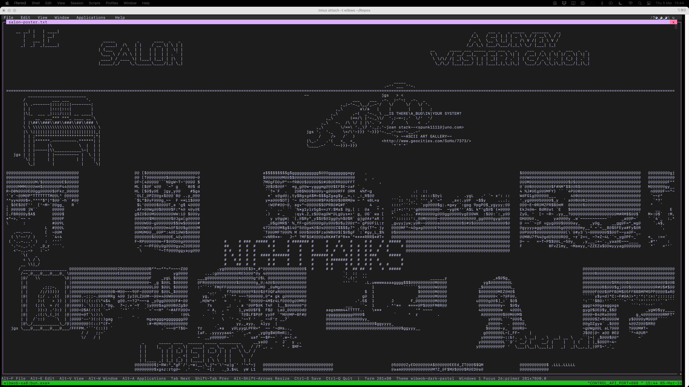

# THE SALON — A Survey of the Western Canon

One massive composited ASCII poster. 16 paintings converted via chafa, Joan Stark
clip art, and figlet typography all baked into a single 316×134 plain text file.



## Files

| File | What |
|------|------|
| `make-salon-poster.py` | The compositor script — runs standalone, outputs `salon-poster.txt` |
| `salon-poster.txt` | The finished poster — open as a primer in WibWob-DOS |
| `salon-poster-shot.png` | Screenshot from the salon tmux session |

## How to regenerate

```bash
# Images need to be in /tmp/salon-primers/ (see script for chafa conversion)
python3 scratch/salon/make-salon-poster.py

# Open in a running WibWob-DOS instance
curl -s -X POST http://127.0.0.1:8099/view/primer/open \
  -H "Content-Type: application/json" \
  -d '{"filePath":"'$(pwd)'/scratch/salon/salon-poster.txt"}'
```

## Stack

- **chafa 1.16** — image → ASCII (50×18 per painting, symbols+ascii mode, no colour)
- **figlet** — banner/big/shadow/slant/script fonts for titles
- **Joan Stark (jgs)** — chandelier, piano, ASCII art gallery badge, girl in mirror,
  masquerade mask, skull w/ rose, rose, moon, grim reaper, knight
- **Python** — 2D canvas compositor with transparency layering
- Session: `tmux attach -t wibwob-salon` (port 8088)

## Paintings included

american_gothic · arnolfini · bosch · gleaners · great_wave · hay_wain ·
last_supper · liberty · nighthawks · pearl_earring · persistence · saturn ·
seurat · wanderer · water_lilies · whistler

ASCII art by jgs (Joan G. Stark) · paintings via Wikimedia Commons
