# WibWob-DOS Current Architecture Report

**Date:** 2026-03-14  
**Codebase:** `src/` — 112 TypeScript files, ~36,340 lines  
**Runtime:** Bun · **Renderer:** blessed · **Entry:** `src/app.ts`

---

## 1. Mermaid Architecture Diagram

```mermaid
graph TB
    subgraph ENTRY ["Entry Layer (329 lines)"]
        style ENTRY fill:#1a1a2e,stroke:#16213e,color:#e0e0e0
        APP["app.ts<br/>51L · bootstrap"]
        CLI["cli/wibwob.ts<br/>278L · HTTP CLI client"]
        style APP fill:#2d6a4f,stroke:#40916c,color:#fff
        style CLI fill:#2d6a4f,stroke:#40916c,color:#fff
    end

    subgraph CORE ["src/core/ — Application Kernel (12,857 lines, 37 files)"]
        style CORE fill:#1a1a2e,stroke:#16213e,color:#e0e0e0

        subgraph CORE_GOD ["⚠️ God Objects"]
            style CORE_GOD fill:#3d0000,stroke:#ff4444,color:#fff
            AC["app-controller.ts<br/>2,244L · 10+ resp · F"]
            UIP["ui-parts.ts<br/>2,395L · 17 resp · F"]
            OM["overlay-manager.ts<br/>937L · 7 resp · D"]
        end

        subgraph CORE_CMD ["Command System"]
            style CORE_CMD fill:#1e3a5f,stroke:#4a90d9,color:#e0e0e0
            CC["command-catalog.ts<br/>1,307L · 2 resp · B"]
            CR["command-registry.ts<br/>306L · 2 resp · B"]
            CMI["context-menu-items.ts<br/>87L · 1 resp · A"]
        end

        subgraph CORE_WIN ["Window System"]
            style CORE_WIN fill:#1e3a5f,stroke:#4a90d9,color:#e0e0e0
            WM["window-manager.ts<br/>730L · 4 resp · C"]
            WF["window-facade.ts<br/>32L · 1 resp · A"]
            WC["window-chrome.ts<br/>40L · 1 resp · A"]
            SR["snapshot-registry.ts<br/>427L · 2 resp · B"]
            WS["workspace-snapshots.ts<br/>41L · 1 resp · A"]
        end

        subgraph CORE_UI ["UI Primitives"]
            style CORE_UI fill:#1e3a5f,stroke:#4a90d9,color:#e0e0e0
            UIPRIM["ui-primitives.ts<br/>80L · 1 resp · A"]
            UIPF["ui-parts-forms.ts<br/>881L · 1 resp · B"]
            UIPFB["ui-parts-feedback.ts<br/>275L · 1 resp · A"]
            UIPD["ui-parts-data.ts<br/>438L · 1 resp · A"]
            MODAL["modal.ts<br/>383L · 3 resp · B"]
            MOM["menu-overlay-manager.ts<br/>338L · 2 resp · B"]
            TW["tree-widget.ts<br/>297L · 1 resp · A"]
            GC["grid-canvas.ts<br/>120L · 1 resp · A"]
            PL["panel-layout.ts<br/>335L · 2 resp · B"]
        end

        subgraph CORE_INFRA ["Infrastructure"]
            style CORE_INFRA fill:#1e3a5f,stroke:#4a90d9,color:#e0e0e0
            TYPES["types.ts<br/>352L · 1 resp · B"]
            CONFIG["config.ts<br/>51L · 1 resp · A"]
            CLIFLAGS["cli.ts<br/>66L · 1 resp · A"]
            ANSI["ansi-utils.ts<br/>378L · 1 resp · A"]
            RS["render-scheduler.ts<br/>84L · 1 resp · A"]
            RM["render-monitor.ts<br/>126L · 1 resp · A"]
            SC["shell-chrome.ts<br/>239L · 3 resp · B"]
            RSTAT["runtime-stats.ts<br/>113L · 1 resp · A"]
            DG["desktop-geometry.ts<br/>22L · 1 resp · A"]
            EC["editor-coordinator.ts<br/>247L · 1 resp · A"]
            UP["unicode-patch.ts<br/>94L · 1 resp · A"]
            CT["canvas-types.ts<br/>61L · 1 resp · C"]
            CC2["custom-cursor.ts<br/>72L · 1 resp · A"]
            ES["empty-states.ts<br/>11L · 1 resp · A"]
            SKEL["skeleton-renderer.ts<br/>273L · 2 resp · B"]
            AS2["appearance-service.ts<br/>24L · 1 resp · A"]
            PRIM["primitives.ts<br/>36L · barrel · A"]
        end

        subgraph CORE_THEME ["Theme Engine"]
            style CORE_THEME fill:#1e3a5f,stroke:#4a90d9,color:#e0e0e0
            TR["theme/resolver.ts<br/>fan-in: 19"]
            TT["theme/types.ts"]
        end
    end

    subgraph SERVICES ["src/services/ — Service Layer (13,277 lines, 44 files)"]
        style SERVICES fill:#1a1a2e,stroke:#16213e,color:#e0e0e0

        subgraph SVC_GOD ["⚠️ God Objects"]
            style SVC_GOD fill:#3d0000,stroke:#ff4444,color:#fff
            WAS["wibwob-agent-session.ts<br/>1,063L · 7+ resp · F"]
            CBS["chrome-browser-service.ts<br/>1,029L · 5+ resp · D"]
            CAPI["control-api.ts<br/>795L · 4 resp · D"]
        end

        subgraph SVC_AGENT ["Agent/AI"]
            style SVC_AGENT fill:#1e3a5f,stroke:#4a90d9,color:#e0e0e0
            AT["agent-tools.ts<br/>533L · 2 resp · C"]
            SB["scramble-brain.ts<br/>368L · 4 resp · C"]
            PSB["pi-session-bridge.ts<br/>453L · 4 resp · C"]
            ASH["agent-session-helpers.ts<br/>42L · 1 resp · A"]
            SLR["slash-router.ts<br/>40L · 1 resp · A"]
        end

        subgraph SVC_ENGINE ["Rendering Engines"]
            style SVC_ENGINE fill:#1e3a5f,stroke:#4a90d9,color:#e0e0e0
            CE["contour-engine.ts<br/>790L · 4 resp · D"]
            PE["plasma-engine.ts<br/>506L · 3 resp · C"]
            TM["terrain-model.ts<br/>394L · 3 resp · C"]
            TRENDR["terrain-render.ts<br/>657L · 2 resp · C"]
            ANIS["animation-service.ts<br/>234L · 1 resp · A"]
        end

        subgraph SVC_CONTENT ["Content & Media"]
            style SVC_CONTENT fill:#1e3a5f,stroke:#4a90d9,color:#e0e0e0
            CS["content-service.ts<br/>228L · 3 resp · B"]
            CM["content-measurement.ts<br/>134L · 1 resp · A"]
            FS2["figlet-service.ts<br/>241L · 3 resp · B"]
            MS["markdown-service.ts<br/>442L · 2 resp · B"]
            SH["syntax-highlight.ts<br/>177L · 1 resp · A"]
            APC["audio-player-controller.ts<br/>508L · 2 resp · C"]
            MCS["monster-cam-service.ts<br/>172L · 2 resp · B"]
        end

        subgraph SVC_EXT ["External Integrations"]
            style SVC_EXT fill:#1e3a5f,stroke:#4a90d9,color:#e0e0e0
            BSS["brave-search-service.ts<br/>235L · 2 resp · B"]
            YTS["youtube-transcript-service.ts<br/>75L · 1 resp · A"]
            WCT["world-chat-transport.ts<br/>170L · 2 resp · B"]
            WCS["world-chat-service.ts<br/>336L · 3 resp · C"]
        end

        subgraph SVC_INFRA ["Infrastructure"]
            style SVC_INFRA fill:#1e3a5f,stroke:#4a90d9,color:#e0e0e0
            SS["state-service.ts<br/>161L · 2 resp · A"]
            CAPS["capability-service.ts<br/>162L · 2 resp · B"]
            AL["app-logger.ts<br/>61L · 1 resp · A"]
            ML["module-loader.ts<br/>574L · 4 resp · C"]
            MSDK["microapp-sdk.ts<br/>403L · barrel · B"]
            WSS["workspace-service.ts<br/>62L · 1 resp · A"]
        end

        subgraph SVC_TIMELINE ["Timeline/VJ"]
            style SVC_TIMELINE fill:#1e3a5f,stroke:#4a90d9,color:#e0e0e0
            TS2["timeline-service.ts<br/>390L · 3 resp · B"]
            TT2["timeline-types.ts<br/>229L · types · A"]
            SLP["scene-layout.ts<br/>131L · 1 resp · A"]
            SPL["scene-planner.ts<br/>160L · 1 resp · A"]
        end

        subgraph SVC_UTIL ["Utilities"]
            style SVC_UTIL fill:#1e3a5f,stroke:#4a90d9,color:#e0e0e0
            RL["rate-limiter.ts<br/>19L · A"]
            SA["strip-ansi.ts<br/>95L · A"]
            EDS["editor-service.ts<br/>42L · A"]
            MOTS["motion-service.ts<br/>192L · B"]
        end
    end

    subgraph WINDOWS ["src/windows/ — Window Factories (8,377 lines, 17 files)"]
        style WINDOWS fill:#1a1a2e,stroke:#16213e,color:#e0e0e0

        subgraph WIN_GOD ["⚠️ God Objects"]
            style WIN_GOD fill:#3d0000,stroke:#ff4444,color:#fff
            BW["browser-windows.ts<br/>2,082L · 4 types · F"]
            MPW["music-player-window.ts<br/>1,224L · 5 resp · D"]
        end

        subgraph WIN_AGENT ["Agent Windows"]
            style WIN_AGENT fill:#1e3a5f,stroke:#4a90d9,color:#e0e0e0
            WAW["wibwob-agent-window.ts<br/>556L · 6 resp · C"]
            ASC["agent-slash-commands.ts<br/>131L · 1 resp · B"]
            WAR["wibwob-agent-render.ts<br/>234L · 1 resp · A"]
            SW["scramble-window.ts<br/>573L · 2 modes · C"]
        end

        subgraph WIN_GEN ["Generative/Viz"]
            style WIN_GEN fill:#1e3a5f,stroke:#4a90d9,color:#e0e0e0
            GW["generative-windows.ts<br/>327L · 7 types · D"]
            CW["contour-window.ts<br/>397L · 2 resp · B"]
            PW["plasma-window.ts<br/>314L · 2 resp · B"]
            TLW["terrain-lab-window.ts<br/>253L · 2 resp · B"]
            MCW["monster-cam-window.ts<br/>164L · 2 resp · A"]
            MCM["monster-cam-model.ts<br/>97L · 1 resp · A"]
        end

        subgraph WIN_CONTENT ["Content Windows"]
            style WIN_CONTENT fill:#1e3a5f,stroke:#4a90d9,color:#e0e0e0
            TXW["text-windows.ts<br/>335L · 2 resp · B"]
            FW["figlet-windows.ts<br/>230L · 2 resp · B"]
            CBW["chrome-browser-window.ts<br/>476L · 4 resp · C"]
        end

        subgraph WIN_BACKROOMS ["Backrooms"]
            style WIN_BACKROOMS fill:#1e3a5f,stroke:#4a90d9,color:#e0e0e0
            BKW["backrooms-windows.ts<br/>705L · 4 resp · D"]
            BLBW["backrooms-log-browser-window.ts<br/>279L · 3 resp · B"]
        end
    end

    subgraph MODULES ["modules/ — Microapp Plugins"]
        style MODULES fill:#1a1a2e,stroke:#4a4a6a,color:#e0e0e0
        MOD["loaded via module-loader.ts<br/>theme + microapp modules"]
    end

    subgraph TESTS ["src/tests/ — Test Suite (14 files, ~1,500 lines)"]
        style TESTS fill:#1a1a2e,stroke:#4a4a6a,color:#e0e0e0
        UT["6 unit tests"]
        IT["6 integration tests<br/>(HTTP against running app)"]
    end

    %% === ENTRY → CORE (correct direction) ===
    APP -->|"imports"| AC
    APP -->|"imports"| CLIFLAGS

    %% === CLI → Control API (HTTP, no imports — excellent) ===
    CLI -.->|"HTTP only"| CAPI

    %% === CORE internal dependencies ===
    AC -->|"32 imports"| CR
    AC --> CC
    AC --> WM
    AC --> OM
    AC --> TR
    AC --> RS

    CR --> CC
    CC --> TYPES
    CMI --> CR

    WM --> WF
    WM --> TYPES
    WM --> TR
    SR --> WF
    SR --> TYPES
    WS --> SR

    OM --> MODAL
    OM --> TR
    UIP --> UIPRIM
    UIP --> TR
    UIPF --> TR
    UIPD --> TR
    GC --> ANSI
    PL --> UIP
    EC --> WM
    EC --> OM

    %% === FAN-IN hubs ===
    TYPES -.->|"fan-in: 25"| TYPES
    UIP -.->|"fan-in: 21"| UIP
    TR -.->|"fan-in: 19"| TR

    %% === CORE → SERVICES (37 imports, almost all from app-controller) ===
    AC ==>|"15+ svc imports"| ML
    AC ==> SS
    AC ==> CAPI
    AC ==> CS
    AC ==> FS2
    AC ==> WAS
    AC ==> CBS
    AC ==> PE
    AC ==> CAPS

    %% === CORE → WINDOWS (13 imports, all from app-controller) ===
    AC ==>|"13 window imports"| BW
    AC ==> WAW
    AC ==> FW
    AC ==> GW
    AC ==> CW
    AC ==> PW
    AC ==> TLW
    AC ==> SW
    AC ==> MCW
    AC ==> MPW
    AC ==> CBW
    AC ==> BKW

    %% === LAYER VIOLATION: core → modules ===
    CT -.->|"❌ layer violation"| MOD

    %% === SERVICES → CORE (70 imports — correct direction) ===
    ML -->|"12 core imports"| CONFIG
    ML --> SR
    ML --> TR
    ML --> TYPES
    ML --> WM
    ML --> CR
    ML --> CC
    ML --> UIP
    ML --> OM

    CAPI --> TYPES
    CAPI --> CR
    CAPI --> CC
    CAPI --> RSTAT

    SS --> TYPES
    SS --> TR
    AT --> TYPES
    AT --> CR
    AT --> WF
    CM --> ANSI
    MSDK -->|"~20 re-exports"| UIP
    MSDK --> UIPRIM
    MSDK --> GC

    %% === SERVICES internal ===
    WAS --> AT
    WAS --> PSB
    WAS --> APC
    AT --> BSS
    AT --> YTS
    AT --> CBS
    SB --> PSB
    SB --> RL
    SB --> SLR
    TM --> CE
    TRENDR --> CE
    TRENDR --> TM
    PE --> ANIS
    CE --> ANIS
    MS --> SH
    MS --> FS2
    TS2 --> TT2
    TS2 --> SPL
    TS2 --> SLP
    SPL --> SLP
    SPL --> TT2
    CAPS --> CBS
    WCS --> WCT
    ML --> WCS

    %% === WINDOWS → CORE (74 imports — correct direction) ===
    BW --> TR
    BW --> UIP
    BW --> UIPRIM
    BW --> ANSI
    BW --> TYPES
    BW --> OM
    BW --> WM
    WAW --> TR
    WAW --> UIP
    WAW --> UIPRIM
    WAW --> TYPES
    WAW --> WM
    WAW --> CONFIG
    SW --> TR
    SW --> UIP
    SW --> UIPRIM
    SW --> WM
    MPW --> TR
    MPW --> UIP
    MPW --> WM
    MPW --> OM

    %% === WINDOWS → SERVICES (25 imports — correct direction) ===
    BW --> MS
    BW --> CM
    BW --> ANIS
    CBW --> CBS
    CBW --> MS
    WAW --> WAS
    WAW --> PSB
    WAW --> APC
    WAW --> ASH
    SW --> SB
    CW --> CE
    PW --> PE
    TLW --> CE
    MCW --> MCS
    BKW --> ML
    MPW --> APC

    %% === WINDOWS internal ===
    WAW --> ASC
    WAW --> WAR
    SW --> WAR
    MCW --> MCM
    BKW --> BLBW
    CW --> GW
    PW --> GW
    TLW --> GW

    %% === MODULES → SDK ===
    MOD -->|"imports SDK"| MSDK

    %% === TESTS ===
    UT -.-> ANIS
    UT -.-> CM
    UT -.-> RM
    UT -.-> RS
    UT -.-> SR
    IT -.->|"HTTP"| CAPI
```



---

## 2. Layer Summary

| Layer | Files | Lines | Purpose |
|-------|------:|------:|---------|
| Entry | 2 | 329 | Bootstrap + CLI client |
| Core | 37 (+theme) | 12,857 | Kernel: types, window mgmt, commands, UI primitives, composition root |
| Services | 44 | 13,277 | Business logic: agents, engines, integrations, infrastructure |
| Windows | 17 | 8,377 | Window factory functions — UI construction and wiring |
| Tests | 14 | ~1,500 | Unit + integration tests |
| Modules | N (external) | — | Microapp plugins loaded at runtime |
| **Total** | **~114** | **~36,340** | |

---

## 3. Cross-Layer Dependency Audit

| Direction | Count | Verdict | Notes |
|-----------|------:|---------|-------|
| windows → core | 74 | ✅ Correct | Every window imports types, theme, window-manager, ui-parts |
| services → core | 70 | ✅ Correct | Services use core types, config, and registries |
| core → services | 37 | ⚠️ Concentrated | 95%+ from `app-controller.ts` — acceptable for a composition root, but the root does too much |
| windows → services | 25 | ✅ Correct | Windows delegate to service-layer logic |
| core → windows | 13 | ⚠️ Concentrated | 100% from `app-controller.ts` — composition root wiring |
| core → modules | 1 | ❌ Layer violation | `canvas-types.ts` imports from `modules/sy2-chronicles/` |
| modules → SDK | N | ✅ Correct | Modules import only `microapp-sdk.ts` barrel |
| CLI → core | 0 | ✅ Excellent | `wibwob.ts` uses HTTP only — zero internal imports |

### Wrong-Direction Dependencies

1. **`canvas-types.ts` → `modules/sy2-chronicles/panel-types.js`** — Core depends on a plugin module. The type `CEPanelDef` should be defined in core; the module should conform to it.

2. **`app-controller.ts` → 13 window files** — While composition roots legitimately know about everything, the controller *implements* logic that belongs in services (FX scripts, clipboard, action bridge). This makes it a god object rather than a clean compositor.

---

## 4. Per-File Health Inventory

### Rating Scale
- **A** — Clean SRP, low coupling, well-typed, no smells
- **B** — Minor concerns (2 responsibilities, small type gaps, acceptable size)
- **C** — Moderate concerns (3-4 responsibilities, growing coupling)
- **D** — Significant problems (SRP violations, god tendencies, poor type safety)
- **F** — God object / critical structural problem

### src/core/ (37 files)

| File | Lines | Resp. | Health | Key Issue |
|------|------:|:-----:|:------:|-----------|
| ansi-utils.ts | 378 | 1 | A | — |
| **app-controller.ts** | **2,244** | **10+** | **F** | God object: composition root + 9 embedded concerns |
| appearance-service.ts | 24 | 1 | A | Tiny, possibly premature |
| canvas-types.ts | 61 | 1 | C | Layer violation (imports from modules/) |
| cli.ts | 66 | 1 | A | — |
| command-catalog.ts | 1,307 | 2 | B | 900-line data block, intentional |
| command-registry.ts | 306 | 2 | B | Legacy alias map |
| config.ts | 51 | 1 | A | — |
| context-menu-items.ts | 87 | 1 | A | — |
| custom-cursor.ts | 72 | 1 | A | — |
| desktop-geometry.ts | 22 | 1 | A | — |
| editor-coordinator.ts | 247 | 1 | A | Well-extracted |
| empty-states.ts | 11 | 1 | A | — |
| grid-canvas.ts | 120 | 1 | A | — |
| menu-overlay-manager.ts | 338 | 2 | B | blessed `as any` casts |
| modal.ts | 383 | 3 | B | Cohesive transient UI |
| **overlay-manager.ts** | **937** | **7** | **D** | God class: 6 prompt types in one class |
| panel-layout.ts | 335 | 2 | B | — |
| primitives.ts | 36 | 1 | A | Auto-generated barrel |
| render-monitor.ts | 126 | 1 | A | — |
| render-scheduler.ts | 84 | 1 | A | — |
| runtime-stats.ts | 113 | 1 | A | — |
| shell-chrome.ts | 239 | 3 | B | Kaomoji mixed in |
| skeleton-renderer.ts | 273 | 2 | B | Misplaced (not core infra) |
| snapshot-registry.ts | 427 | 2 | B | Growing legacy remap |
| tree-widget.ts | 297 | 1 | A | — |
| types.ts | 352 | 1 | B | WindowRecord bag-of-optionals |
| ui-parts-data.ts | 438 | 1 | A | — |
| ui-parts-feedback.ts | 275 | 1 | A | — |
| ui-parts-forms.ts | 881 | 1 | B | Repetitive but cohesive |
| **ui-parts.ts** | **2,395** | **17** | **F** | God file: 17 responsibility groups |
| ui-primitives.ts | 80 | 1 | A | — |
| unicode-patch.ts | 94 | 1 | A | — |
| window-chrome.ts | 40 | 1 | A | — |
| window-facade.ts | 32 | 1 | A | — |
| window-manager.ts | 730 | 4 | C | Mixed create/focus/drag/layout |
| workspace-snapshots.ts | 41 | 1 | A | — |

### src/services/ (44 files)

| File | Lines | Resp. | Health | Key Issue |
|------|------:|:-----:|:------:|-----------|
| agent-session-helpers.ts | 42 | 1 | A | — |
| agent-tools.ts | 533 | 2 | C | Module-scope singleton, long |
| animation-service.ts | 234 | 1 | A | Exemplary |
| app-logger.ts | 61 | 1 | A | — |
| ascii-composition.ts | 48 | 1 | A | Speculative types |
| audio-player-controller.ts | 508 | 2 | C | God-tendency, singleton |
| backrooms-service.ts | 222 | 3 | C | Feature envy |
| brave-search-service.ts | 235 | 2 | B | DRY violation (htmlToMarkdown) |
| canvas-document.ts | 263 | 3 | B | Switch-on-kind grows |
| capability-service.ts | 162 | 2 | B | — |
| **chrome-browser-service.ts** | **1,029** | **5+** | **D** | God class: nav + images + search + history |
| content-measurement.ts | 134 | 1 | A | — |
| content-service.ts | 228 | 3 | B | Misplaced `completePath` |
| contour-engine.ts | 790 | 4 | D | Full engine in one file |
| **control-api.ts** | **795** | **4** | **D** | 350-line handleRequest, 15+ `as any` |
| editor-service.ts | 42 | 1 | A | — |
| figlet-service.ts | 241 | 3 | B | Unbounded cache |
| file-actions.ts | 118 | 2 | A | — |
| markdown-service.ts | 442 | 2 | B | 10+ `as any` (marked types) |
| microapp-sdk.ts | 403 | 1 | B | Massive barrel, some original types |
| module-loader.ts | 574 | 4 | C | Wide import surface, 12 core imports |
| monster-cam-service.ts | 172 | 2 | B | — |
| monster-cam-worker.ts | 48 | 1 | A | — |
| motion-service.ts | 192 | 1 | B | Duck-typed windowManager |
| pi-session-bridge.ts | 453 | 4 | C | Client + server in one file |
| plasma-engine.ts | 506 | 3 | C | Engine + mood analysis mixed |
| rate-limiter.ts | 19 | 1 | A | — |
| scene-layout.ts | 131 | 1 | A | — |
| scene-planner.ts | 160 | 1 | A | — |
| scramble-brain.ts | 368 | 4 | C | Personality + LLM entangled |
| slash-router.ts | 40 | 1 | A | — |
| state-service.ts | 161 | 2 | A | — |
| strip-ansi.ts | 95 | 1 | A | — |
| syntax-highlight.ts | 177 | 1 | A | — |
| terrain-model.ts | 394 | 3 | C | — |
| terrain-render.ts | 657 | 2 | C | 400-line renderFirstPerson |
| timeline-service.ts | 390 | 3 | B | — |
| timeline-types.ts | 229 | 1 | A | Pure types |
| webcam-renderer.ts | 233 | 1 | A | — |
| **wibwob-agent-session.ts** | **1,063** | **7+** | **F** | God class: 6 tool factories + agent lifecycle |
| workspace-service.ts | 62 | 1 | A | — |
| workspace-ui.ts | 42 | 1 | A | — |
| world-chat-service.ts | 336 | 3 | C | Singleton with side effects |
| world-chat-transport.ts | 170 | 2 | B | — |
| youtube-transcript-service.ts | 75 | 1 | A | — |

### src/windows/ (17 files)

| File | Lines | Resp. | Health | Key Issue |
|------|------:|:-----:|:------:|-----------|
| agent-slash-commands.ts | 131 | 1 | B | if-chain, could be dispatch table |
| backrooms-log-browser-window.ts | 279 | 3 | B | — |
| backrooms-windows.ts | 705 | 4 | D | 460-line function, closure soup |
| **browser-windows.ts** | **2,082** | **4** | **F** | 4 unrelated window types; file-manager alone is 1,400L |
| chrome-browser-window.ts | 476 | 4 | C | Image pipeline in window |
| contour-window.ts | 397 | 2 | B | — |
| figlet-windows.ts | 230 | 2 | B | Misplaced `openBrowserReaderWindow` |
| generative-windows.ts | 327 | 7 | D | Grab-bag of 7 window types |
| monster-cam-model.ts | 97 | 1 | A | Elm-style, exemplary |
| monster-cam-window.ts | 164 | 2 | A | — |
| **music-player-window.ts** | **1,224** | **5** | **D** | FFT, audio engine, 4 viz modes in window file |
| plasma-window.ts | 314 | 2 | B | Duplicated ANSI constants |
| scramble-window.ts | 573 | 2 | C | 60% duplication between modes |
| terrain-lab-window.ts | 253 | 2 | B | Duplicated ANSI constants |
| text-windows.ts | 335 | 2 | B | — |
| wibwob-agent-render.ts | 234 | 1 | A | — |
| wibwob-agent-window.ts | 556 | 6 | C | Duplicated wireInput, inline player bar |

### src/app.ts + src/cli/ + src/tests/

| File | Lines | Health | Key Issue |
|------|------:|:------:|-----------|
| app.ts | 51 | A | Minor: PID logic extractable |
| cli/wibwob.ts | 278 | B | Zero internal coupling (excellent); 5 inline casts |
| tests/ (14 files) | ~1,500 | B | Duplicated API helpers across 6 files |

---

## 5. Fan-In / Fan-Out Analysis

### Highest Fan-In (most depended on)

| File | Fan-In | Role |
|------|-------:|------|
| types.ts | 25 | Central type definitions — healthy hub |
| ui-parts.ts | 21 | UI primitive library — too large, too many responsibilities |
| theme/resolver.ts | 19 | Theme token provider — healthy hub |
| window-manager.ts | 12 | Window lifecycle — expected for a WM |
| ui-primitives.ts | 11 | Low-level helpers — healthy |
| overlay-manager.ts | 10 | Prompt/dialog system — healthy dependency target |

### Highest Fan-Out (most dependencies)

| File | Fan-Out | Role | Concern |
|------|--------:|------|---------|
| app-controller.ts | 32 | Composition root | Expected, but root does too much |
| module-loader.ts | 14 | Module integration | Expected bridge role |
| browser-windows.ts | 12 | 4 window types | Too many things in one file |
| microapp-sdk.ts | ~20 | SDK barrel | By design |

---

## 6. Tightly Coupled Clusters

### Cluster 1: Agent System
```
wibwob-agent-session.ts ←→ agent-tools.ts ←→ brave-search-service.ts
         ↕                                      ↕
pi-session-bridge.ts              chrome-browser-service.ts
         ↕
wibwob-agent-window.ts ← agent-slash-commands.ts ← wibwob-agent-render.ts
         ↕
scramble-window.ts ← scramble-brain.ts ← slash-router.ts
```
**6-8 files tightly interwoven.** The session owns tools, bridge, and model selection; the window owns rendering, input, and slash commands; Scramble reuses render helpers. Refactoring the session requires touching 3+ files.

### Cluster 2: Terrain/Contour Rendering
```
contour-engine.ts → animation-service.ts
       ↑
terrain-model.ts → contour-engine.ts
       ↑
terrain-render.ts → terrain-model.ts + contour-engine.ts
       ↑
terrain-lab-window.ts + contour-window.ts
```
**5 files, clean linear dependency chain.** Well-structured pipeline. Could be moved to `src/engines/terrain/` for clarity.

### Cluster 3: Content Pipeline
```
content-service.ts → content-measurement.ts ← figlet-service.ts
                                                     ↑
                                             markdown-service.ts → syntax-highlight.ts
```
**5 files, clean.** Measurement is the shared primitive; figlet and markdown build on it. Good structure.

### Cluster 4: Composition Root Fan-Out
```
app-controller.ts → [15 services, 13 windows, 20 core files]
```
**Single point of coupling.** Expected for a composition root, but the 2,244-line size and 10+ embedded responsibilities make it the #1 structural risk.

---

## 7. Well-Decoupled Files (Exemplary)

| File | Why |
|------|-----|
| `cli/wibwob.ts` | Zero internal imports — pure HTTP client |
| `animation-service.ts` | Zero imports, pure framework code |
| `render-scheduler.ts` | Zero imports, pure scheduling logic |
| `render-monitor.ts` | Zero imports, pure measurement |
| `rate-limiter.ts` | Zero imports, 19-line generic utility |
| `slash-router.ts` | Zero imports, 40-line generic utility |
| `timeline-types.ts` | Zero imports, pure type definitions |
| `monster-cam-model.ts` | Single import, pure Elm-style model |
| `editor-service.ts` | Single import (types), pure state operations |

---

## 8. God Object Inventory

| File | Lines | Resp. | Layer | Structural Risk |
|------|------:|:-----:|-------|-----------------|
| **ui-parts.ts** | 2,395 | 17 | core | Highest. 17 distinct feature groups. Every new UI primitive widens this file. |
| **app-controller.ts** | 2,244 | 10+ | core | Critical. All cross-layer wiring runs through this. Adding any feature = editing this file. |
| **browser-windows.ts** | 2,082 | 4 | windows | High. 4 unrelated windows; file-manager is 1,400 lines with git, ripgrep, clipboard. |
| **music-player-window.ts** | 1,224 | 5 | windows | Moderate. FFT engine + audio controller belong in services. |
| **wibwob-agent-session.ts** | 1,063 | 7+ | services | High. 6 tool factories + agent lifecycle. Most `any` casts. |
| **chrome-browser-service.ts** | 1,029 | 5+ | services | Moderate. Navigation pipeline, image handling, search — distinct pipelines. |
| **overlay-manager.ts** | 937 | 7 | core | Moderate. 6 prompt types could be individual files. |
| **control-api.ts** | 795 | 4 | services | Moderate. Hand-rolled routing with 15+ `as any`. |
| **contour-engine.ts** | 790 | 4 | services | Low-moderate. Self-contained engine, but 4 distinct layers. |

**Total god-object lines: ~12,759 (35% of codebase)**

---

## 9. Type Safety Summary

| Category | Count | Worst Offenders |
|----------|------:|-----------------|
| `as any` casts | ~100+ | control-api.ts (~15), wibwob-agent-session.ts (~15), browser-windows.ts (~15), markdown-service.ts (~10), music-player-window.ts (~5) |
| `(list as List & { selected })` | ~25+ | Pervasive blessed type gap — systemic, not individual fault |
| `@ts-ignore` | 3 | Missing type packages (turndown-plugin-gfm, youtube-transcript-plus) |
| `as unknown as` force casts | ~10 | Test stubs, API bridge duck-typing |
| Untyped `catch {}` | ~20+ | Audio, filesystem, network code |

The blessed type gap (`selected` property) accounts for ~25% of all type unsafety. A single `BlessedListWithSelected` type alias would fix all 25+ instances.

---

## 10. Duplicated Code Patterns

| Pattern | Files | Lines Wasted |
|---------|-------|-------------|
| `htmlToMarkdown` (Turndown config) | `brave-search-service.ts`, `chrome-browser-service.ts` | ~40 |
| Draft input wiring (`wireInput`) | `scramble-window.ts`, `wibwob-agent-window.ts` | ~60 |
| ANSI colour constants (`A` object) | `plasma-window.ts`, `terrain-lab-window.ts` | ~20 |
| Test API helpers (`post/get/sleep`) | 6 test files | ~120 |
| `tui_run_command` shortening regex | `wibwob-agent-render.ts` (2 places) | ~10 |
| **Total estimated** | | **~250 lines** |

---

## 11. Overall Architecture Health Narrative

### What Works Well

**The layering is fundamentally sound.** The dependency arrows overwhelmingly flow downward: windows → services → core. The CLI client achieves zero coupling via HTTP. The module system is properly isolated behind a barrel SDK. Services like `animation-service.ts`, `render-scheduler.ts`, and `render-monitor.ts` are textbook single-responsibility designs. The Elm-style `monster-cam-model.ts` / `monster-cam-window.ts` split shows the team knows how to separate concerns when they choose to.

**The type system is working.** The `PersistableAppType` + `satisfies Record<...>` pattern in `snapshot-registry.ts` provides compiler-enforced exhaustive coverage. The `WindowFacade` interface decouples window operations from implementation. The `AppCommandDefinition` system with Zod schemas is migrating toward validated commands.

**Fan-in is concentrated on stable abstractions.** The most-imported files (`types.ts`, `theme/resolver.ts`, `ui-primitives.ts`) are stable interfaces that change infrequently. This is healthy hub topology.

### What's Wrong

**35% of the codebase lives in 9 god objects.** The top 9 files by responsibility count contain ~12,759 lines — over a third of the entire codebase. These files are the primary source of merge conflicts, cognitive overhead, and "shotgun surgery" (changing one feature requires editing multiple distant locations in the same file).

**`app-controller.ts` is a black hole.** With 32 fan-out imports — touching 15+ services, 13 window types, and 20 core files — it's the single most coupled file. It's supposed to be a composition root, but it implements FX scripts, clipboard operations, action bridging (520 lines), and primer info resolution. Every new feature gravitates toward this file.

**`ui-parts.ts` is a junk drawer.** At 2,395 lines with 17 responsibility groups, it conflates layout primitives, pattern generators, colour helpers, data simulation, sidebar panels, inline search, and tabbed containers. It has the highest fan-in of any non-type file (21 importers), meaning splitting it requires updating 21 files — but the cost only grows as more code depends on it.

**The services layer lacks internal structure.** 44 files in a flat directory spanning rendering engines, AI agents, external integrations, media controllers, and generic utilities. `strip-ansi.ts` (a text utility) sits next to `chrome-browser-service.ts` (a 1,029-line Puppeteer wrapper). The folder is a "not core, not windows" catch-all.

**Type safety is poor at system boundaries.** The control API has 15+ `as any` casts on request bodies. The agent session has 15+ `any` casts in tool handlers. The blessed library's incomplete types force ~25 identical cast patterns. These are fixable with Zod validation (API), proper tool typing (agent), and a shared blessed extension type (UI).

### Structural Risks

1. **Accretion pressure on god objects.** Without extraction, `app-controller.ts` and `ui-parts.ts` will continue growing. Each new window type adds ~30 lines to the controller (open method + action bridge + restore handler). Each new UI component adds to `ui-parts.ts` because "that's where things go."

2. **Testing bottleneck.** God objects are hard to unit test. The 6 integration tests all duplicate API helpers and use magic sleep values instead of polling. Adding test coverage requires first making the code testable by extracting dependencies.

3. **One canonical layer violation.** `canvas-types.ts` importing from `modules/` is a live inversion that could spread if not addressed.

### Recommended Priority Order

| Priority | Action | Impact | Effort | Lines Affected |
|----------|--------|--------|--------|----------------|
| 1 | Split `ui-parts.ts` into 5-6 focused files | Eliminates largest god file, improves discoverability | Medium | ~2,395 → 6×400 |
| 2 | Extract action bridge + FX + clipboard from `app-controller.ts` | Slims composition root by ~800 lines | Medium | ~2,244 → ~1,400 |
| 3 | Split `browser-windows.ts` into 4 files | Eliminates largest window god file | Medium | ~2,082 → 4×500 |
| 4 | Split `wibwob-agent-session.ts` (tool factories → own files) | Makes agent system testable | Medium | ~1,063 → 5×200 |
| 5 | Extract `AudioController` + `AudioAnalyser` + viz from `music-player-window.ts` | Reusable audio engine, testable DSP | Medium | ~1,224 → ~400 |
| 6 | Fix `canvas-types.ts` layer violation | Architectural correctness | Low | ~10 lines |
| 7 | Create shared blessed extension types | Eliminates ~25 identical casts | Low | ~5 lines, 25 consumers |
| 8 | Extract shared test helpers | Eliminates ~120 lines duplication | Low | 6 test files |
| 9 | Migrate `control-api.ts` to Hono or extract routes | Eliminates 350-line handler + 15 `as any` | High | ~795 |
| 10 | Restructure services/ into subdirectories | Navigability for 44 files | Low | 0 code changes, path updates |

**Bottom line:** The architecture has good bones — clean layers, stable abstractions at hubs, proper module isolation. The illness is concentrated: 9 god objects containing 35% of the code. Splitting those 9 files is the single highest-leverage intervention. Everything else (type safety, duplication, test infrastructure) becomes tractable once the god objects are decomposed.
