# WibWob-DOS Target Architecture

**Author:** Architecture review, 2026-03-14  
**Status:** Proposed  
**Scope:** Complete src/ reorganisation — incremental, backward-compatible

---

## 1. Desired End State — Mermaid Diagram

```mermaid
graph TB
    subgraph "Entry Points"
        APP["src/app.ts"]
        CLI["src/cli/ww.ts"]
    end

    subgraph "src/core/ — Shell Kernel"
        direction TB

        subgraph "Composition Root"
            AC["app-controller.ts ≤600 lines"]
            AB["action-bridge.ts"]
            WO["window-openers.ts"]
        end

        subgraph "Command System (E039 zone)"
            CC["command-catalog.ts"]
            CR["command-registry.ts"]
            CMI["context-menu-items.ts"]
        end

        subgraph "Window System"
            WM["window-manager.ts"]
            WF["window-facade.ts"]
            WC["window-chrome.ts"]
            WI["window-interaction.ts"]
        end

        subgraph "Overlays"
            OM["overlay-manager.ts ≤300 lines"]
            BP["overlays/browser-prompt.ts"]
            FBP["overlays/file-browser-prompt.ts"]
            LP["overlays/list-picker.ts"]
            MOM["menu-overlay-manager.ts"]
            MOD["modal.ts"]
        end

        subgraph "UI Toolkit"
            UIP["ui-primitives.ts"]
            UIL["ui-layout.ts (stack/row/grid)"]
            UIC["ui-chrome.ts (header/status/rule)"]
            UITB["ui-tabs.ts"]
            UIScr["ui-scroll-viewport.ts"]
            UISb["ui-sidebar.ts"]
            UISel["ui-selectable-list.ts"]
            UISearch["ui-inline-search.ts"]
            UIDraft["ui-draft-input.ts"]
            UIForms["ui-parts-forms.ts"]
            UIFeedback["ui-parts-feedback.ts"]
            UIData["ui-parts-data.ts"]
            TW["tree-widget.ts"]
        end

        subgraph "Shared Utilities"
            ANSI["ansi-utils.ts"]
            PAT["patterns.ts"]
            COL["colour-utils.ts"]
            GC["grid-canvas.ts"]
            PL["panel-layout.ts"]
            CFG["config.ts"]
            TYPES["types.ts"]
            EMPTY["empty-states.ts"]
            DG["desktop-geometry.ts"]
        end

        subgraph "Theme"
            TR["theme/resolver.ts"]
            TT["theme/types.ts"]
            TD["theme/*.ts (variants)"]
        end

        subgraph "Render Pipeline"
            RS["render-scheduler.ts"]
            RM["render-monitor.ts"]
            RSTATS["runtime-stats.ts"]
        end

        subgraph "Persistence"
            SR["snapshot-registry.ts"]
            WS["workspace-snapshots.ts"]
        end

        subgraph "Other Core"
            CLIF["cli.ts"]
            CC2["custom-cursor.ts"]
            SC["shell-chrome.ts"]
            EC["editor-coordinator.ts"]
            UP["unicode-patch.ts"]
            APP_SVC["appearance-service.ts"]
        end
    end

    subgraph "src/services/ — Business Logic"
        direction TB

        subgraph "API & State"
            CAPI["control-api.ts"]
            SS["state-service.ts"]
            CAPS["capability-service.ts"]
            LOG["app-logger.ts"]
        end

        subgraph "Agent"
            WAS["wibwob-agent-session.ts ≤400 lines"]
            AT["agent-tools.ts"]
            JT["agent/jailed-tools.ts"]
            ST["agent/session-tools.ts"]
            MT["agent/music-tools.ts"]
            TF["agent/tool-formatting.ts"]
            PL2["agent/prompt-loader.ts"]
            SB["scramble-brain.ts"]
            ASH["agent-session-helpers.ts"]
            PSB["pi-session-bridge.ts"]
        end

        subgraph "Content"
            CS["content-service.ts"]
            CM["content-measurement.ts"]
            MS["markdown-service.ts"]
            FS2["figlet-service.ts"]
            SH["syntax-highlight.ts"]
            HTM["html-to-markdown.ts"]
        end

        subgraph "File & Workspace"
            FA["file-actions.ts"]
            WKS["workspace-service.ts"]
            WUI["workspace-ui.ts"]
            CD["canvas-document.ts"]
            ES["editor-service.ts"]
        end

        subgraph "Media"
            APC["audio-player-controller.ts"]
            AL["audio-library.ts"]
            AA["audio-analyser.ts"]
            MCS["monster-cam-service.ts"]
            MCW["monster-cam-worker.ts"]
            WR["webcam-renderer.ts"]
            SKR["skeleton-renderer.ts"]
        end

        subgraph "External"
            CBS["chrome-browser-service.ts"]
            BSS["brave-search-service.ts"]
            YTS["youtube-transcript-service.ts"]
            WCS["world-chat-service.ts"]
            WCT["world-chat-transport.ts"]
            BKS["backrooms-service.ts"]
        end

        subgraph "Engines"
            ANI["animation-service.ts"]
            CE["contour-engine.ts"]
            PE["plasma-engine.ts"]
            TM["terrain-model.ts"]
            TRR["terrain-render.ts"]
            MOT["motion-service.ts"]
        end

        subgraph "Timeline"
            TS["timeline-service.ts"]
            TT2["timeline-types.ts"]
            SL["scene-layout.ts"]
            SP["scene-planner.ts"]
        end

        subgraph "Pure Utilities"
            SA["strip-ansi.ts"]
            RL["rate-limiter.ts"]
            SLR["slash-router.ts"]
        end

        subgraph "SDK Surface"
            SDK["microapp-sdk.ts"]
        end

        subgraph "Module System"
            ML["microapp-loader.ts"]
        end
    end

    subgraph "src/windows/ — Window Factories"
        direction TB
        subgraph "Agent Windows"
            WAW["wibwob-agent-window.ts"]
            WASC["agent-slash-commands.ts"]
            WAR["wibwob-agent-render.ts"]
            SCW["scramble-window.ts"]
        end
        subgraph "Browser Windows (split)"
            PBW["primer-browser-window.ts"]
            PGW["primer-gallery-window.ts"]
            TVW["text-viewer-window.ts"]
            FMW["file-manager-window.ts"]
        end
        subgraph "Generative (split)"
            AWN["animated-windows.ts"]
            WSMW["workspace-manager-window.ts"]
            CPW["command-palette-window.ts"]
            SIW["state-inspector-window.ts"]
        end
        subgraph "Specialised"
            CBW["chrome-browser-window.ts"]
            CW["contour-window.ts"]
            FW["figlet-windows.ts"]
            MPW["music-player-window.ts ≤400 lines"]
            MVZ["music-viz-modes.ts"]
            PW["plasma-window.ts"]
            TLW["terrain-lab-window.ts"]
            MCWin["monster-cam-window.ts"]
            MCMod["monster-cam-model.ts"]
        end
        subgraph "Backrooms"
            BW["backrooms-windows.ts ≤300 lines"]
            BLBW["backrooms-log-browser-window.ts"]
            BPPW["backrooms-primer-picker.ts"]
        end
        subgraph "Text"
            TEW["text-windows.ts"]
        end
        subgraph "Shared"
            ANSI_COLS["window-ansi-constants.ts"]
        end
    end

    subgraph "src/tests/"
        TH["helpers/api-client.ts"]
        TESTS["*.test.ts"]
    end

    %% Dependency arrows (allowed directions)
    APP --> AC
    CLI --> CAPI

    AC --> AB
    AC --> WO
    AC --> CR
    AC --> WM
    AC --> OM
    AC --> RS

    WO -->|"opens"| WAW
    WO -->|"opens"| FMW
    WO -->|"opens"| PW

    CAPI --> CR
    CAPI --> SS

    ML --> CR
    ML --> WM
    ML --> SDK

    SDK -->|"re-exports"| UIL
    SDK -->|"re-exports"| UIForms
    SDK -->|"re-exports"| ANI

    WAW --> WAR
    WAW --> WASC

    %% Layer rules
    style AC fill:#ff9999
    style WO fill:#ff9999
    style AB fill:#ff9999
```



### Layer Dependency Rules (Simplified)

```
┌─────────────────────────────────────────────────────────────┐
│                     Entry Points                            │
│  app.ts, cli/ww.ts                                          │
│  ↓ imports from everything below                            │
├─────────────────────────────────────────────────────────────┤
│                  Composition Root                           │
│  app-controller.ts, action-bridge.ts, window-openers.ts     │
│  ↓ imports services/, windows/, core/                       │
│  (ONLY place allowed to import from windows/)               │
├─────────────────────────────────────────────────────────────┤
│                    windows/                                  │
│  Window factory functions                                    │
│  ↓ imports services/, core/ (never core/app-controller)     │
├─────────────────────────────────────────────────────────────┤
│                    services/                                 │
│  Business logic, engines, external integrations              │
│  ↓ imports core/ only (never windows/)                      │
├─────────────────────────────────────────────────────────────┤
│                      core/                                   │
│  Types, UI toolkit, utilities, window system                 │
│  ↓ imports only: external packages, other core/ files       │
│  NEVER imports from services/ or windows/                   │
├─────────────────────────────────────────────────────────────┤
│                    microapps/                                  │
│  Microapps loaded at runtime                                 │
│  ↓ imports only: microapp-sdk.ts (barrel)                   │
└─────────────────────────────────────────────────────────────┘
```

---

## 2. File-by-File Manifest

### src/app.ts

| Action | Detail |
|--------|--------|
| **EXTRACT** | Extract PID file management → `src/core/pid-file.ts`. Extract `randomSessionId()` → `src/core/cli.ts`. Entry point drops to ~15 lines. |

### src/cli/wibwob.ts

| Action | Detail |
|--------|--------|
| **MOVE + RENAME** | Move to `src/cli/ww.ts` per E039 naming. Extract `cmdCompletions()` → `src/cli/completions.ts`. Extract `parseFlags()` → `src/cli/parse-flags.ts`. Add `src/cli/api-types.ts` for response types. |

### src/core/

| File | Action | Detail |
|------|--------|--------|
| `ansi-utils.ts` | **KEEP** | Exemplary utility. No changes. |
| `app-controller.ts` | **SPLIT** | The big one. See breakdown below. |
| `appearance-service.ts` | **KEEP** | 24 lines, harmless stub. Inline into `theme/resolver.ts` only if light mode never ships. |
| `canvas-types.ts` | **EXTRACT** | Remove `CEPanelDef` import from `microapps/`. Define the shape in core; module conforms to it. Fixes layer inversion. |
| `cli.ts` | **KEEP** | Clean. Absorb `randomSessionId()` from `app.ts`. |
| `command-catalog.ts` | **KEEP (E039 zone)** | E039 will rethink this. Don't restructure — but DO split `APP_COMMANDS` data array into `command-definitions.ts` once E039 lands. Leave file alone until then. |
| `command-registry.ts` | **KEEP (E039 zone)** | Same — E039 will evolve this. Extract `LEGACY_COMMAND_ALIASES` to `command-legacy-aliases.ts` as prep work. |
| `config.ts` | **KEEP** | Remove 5 `@deprecated` aliases. |
| `context-menu-items.ts` | **KEEP** | Clean. |
| `custom-cursor.ts` | **KEEP** | Clean. |
| `desktop-geometry.ts` | **KEEP** | Tiny but fine as standalone. |
| `editor-coordinator.ts` | **KEEP** | Well-extracted. |
| `empty-states.ts` | **KEEP** | Constants file. |
| `grid-canvas.ts` | **KEEP** | Clean utility. |
| `menu-overlay-manager.ts` | **KEEP** | Works fine. Blessed `as any` casts are permanent. |
| `modal.ts` | **KEEP** | Cohesive transient UI. |
| `overlay-manager.ts` | **SPLIT** | Extract each prompt type into `src/core/overlays/`. See breakdown below. |
| `panel-layout.ts` | **KEEP** | Clean layout primitives. |
| `primitives.ts` | **KEEP** | Auto-generated barrel. Update after splits. |
| `render-monitor.ts` | **KEEP** | Clean. |
| `render-scheduler.ts` | **KEEP** | Clean. |
| `runtime-stats.ts` | **KEEP** | Clean. |
| `shell-chrome.ts` | **KEEP** | Kaomoji is quirky but fine. |
| `skeleton-renderer.ts` | **MOVE** | → `src/services/skeleton-renderer.ts`. It's a domain renderer, not core infrastructure. Move pose presets to JSON data file. |
| `snapshot-registry.ts` | **KEEP** | Works well. Growing legacy map is expected. |
| `tree-widget.ts` | **KEEP** | Clean widget. |
| `types.ts` | **KEEP** | `WindowRecord` bag-of-optionals is a known trade-off. Not worth the discriminated union migration cost. Absorb `BaseWindowDeps` from `generative-windows.ts`. |
| `ui-parts.ts` | **SPLIT** | The second big one. See breakdown below. |
| `ui-parts-data.ts` | **KEEP** | Clean. |
| `ui-parts-feedback.ts` | **KEEP** | Clean. |
| `ui-parts-forms.ts` | **KEEP** | Repetitive but functional. |
| `ui-primitives.ts` | **KEEP** | Low-level helpers. |
| `unicode-patch.ts` | **KEEP** | Necessary evil. |
| `window-chrome.ts` | **KEEP** | Clean. |
| `window-facade.ts` | **KEEP** | Clean interface. |
| `window-manager.ts` | **EXTRACT** | Extract drag/resize mouse handling → `window-interaction.ts`. Manager drops from 730 to ~500 lines. |
| `workspace-snapshots.ts` | **KEEP** | Clean delegation. |

#### app-controller.ts SPLIT Plan

Current: 2,244 lines, 10+ responsibilities, 32 imports.

| New File | Lines | What moves there |
|----------|-------|-----------------|
| `app-controller.ts` (slimmed) | ~600 | Constructor (service graph), startup, shutdown, global keybindings, render loop. Pure composition root. |
| `action-bridge.ts` | ~500 | `getAppMenuActions()` factory function. Maps command IDs → controller method calls. |
| `window-openers.ts` | ~400 | All `open*Window` methods extracted as plain functions grouped by domain (text, browser, generative, agent). No registry abstraction in phase 1. |
| `services/fx-service.ts` | ~200 | `runFxScript()`, `smearTextSurface()` — Python shell-outs. |
| `services/clipboard-service.ts` | ~80 | `copyFocusedWindowText()`, `exportFocusedWindowText()`. |

**Justification:** The composition root should compose, not implement. `getAppMenuActions()` is 520 lines of pure boilerplate bridging — it has zero reason to live in the same class. Window opener methods are a second responsibility axis (one per window type). FX/clipboard are feature envy on services.

#### overlay-manager.ts SPLIT Plan

Current: 937 lines, 7 distinct prompt types.

| New File | Lines | What moves there |
|----------|-------|-----------------|
| `overlay-manager.ts` (slimmed) | ~200 | Flash notifications, active overlay tracking, `dispose()`. Thin coordinator that delegates to prompt files. |
| `overlays/browser-prompt.ts` | ~120 | `openBrowserPrompt()` — search+list+preview split-pane. |
| `overlays/file-browser-prompt.ts` | ~170 | `openFileBrowserPrompt()` — directory navigation. |
| `overlays/list-picker.ts` | ~80 | `openCenteredListPrompt()` — simple centered list. |
| `overlays/value-prompt.ts` | ~60 | `promptForValue()` — single text input. |
| `overlays/path-prompt.ts` | ~80 | `promptForPath()` — text input with tab completion. |

**Justification:** Each prompt is self-contained UI logic. The shared search+list+preview widget pattern between browser-prompt and file-browser should be extracted as a helper within `overlays/`.

#### ui-parts.ts SPLIT Plan

Current: 2,395 lines, 17 responsibility groups, 80+ exports.

| New File | Lines | What moves there |
|----------|-------|-----------------|
| `ui-parts.ts` (slimmed) | ~200 | Barrel re-exports from all extracted files. Backward compatibility — existing `import { createStack } from "ui-parts"` keeps working. |
| `ui-layout.ts` | ~250 | `createStack`, `createRow`, `createGrid`, `pickBreakpoint`, responsive breakpoints. |
| `ui-chrome.ts` | ~100 | `createHeader`, `createStatusBar`, `createRuleBar`, `createButtonBar`. |
| `ui-tabs.ts` | ~120 | `createTabs` + tab container. |
| `ui-scroll-viewport.ts` | ~120 | `createScrollViewport`, `createCollapsibleBlocks`, `createContentStacking`. |
| `ui-sidebar.ts` | ~100 | `createSidebarPanel`, `resolveSidebarWidth`. |
| `ui-selectable-list.ts` | ~80 | `createSelectableList`. |
| `ui-inline-search.ts` | ~80 | `createInlineSearch`. |
| `ui-draft-input.ts` | ~60 | **NEW** — Extract shared draft-input pattern from `scramble-window.ts` and `wibwob-agent-window.ts`. |
| `patterns.ts` | ~100 | `PATTERNS`, pattern generator functions, `createRestyleBundle`. |
| `colour-utils.ts` | ~60 | `hslToRgb`, `ansiGradientLine`, gradient helpers. |

**Justification:** 2,395 lines with 17 responsibilities is the definition of a utility dumping ground. Each extracted file has one cohesive purpose. `ui-parts.ts` becomes a barrel that re-exports everything — zero breaking changes.

### src/services/

| File | Action | Detail |
|------|--------|--------|
| `agent-session-helpers.ts` | **KEEP** | Clean utility. |
| `agent-tools.ts` | **EXTRACT** | Extract `braveService` singleton instantiation to DI via `TuiToolContext`. Split web-search tools into separate section or file if it grows. |
| `animation-service.ts` | **KEEP** | Exemplary. |
| `app-logger.ts` | **KEEP** | Clean. |
| `ascii-composition.ts` | **KEEP** | Remove unused `AsciiCompositionNodeSpec` and `AsciiCompositionRole` if no consumers. |
| `audio-player-controller.ts` | **EXTRACT** | Extract `findAudioFiles`/`resolveAudioPath`/`refreshFiles` → `audio-library.ts`. |
| `backrooms-service.ts` | **KEEP** | Acceptable complexity. |
| `brave-search-service.ts` | **EXTRACT** | Extract `htmlToMarkdown` → `html-to-markdown.ts` (shared with chrome-browser-service). |
| `canvas-document.ts` | **KEEP** | Keep explicit `restoreWindowEntry` mapping for now (clear and debuggable). Revisit only if repeated extension pain appears. |
| `capability-service.ts` | **KEEP** | Accept probes as config instead of importing services directly. |
| `chrome-browser-service.ts` | **EXTRACT** | Extract `htmlToMarkdown` → shared `html-to-markdown.ts`. Extract Google search → `google-search.ts` if it grows. |
| `content-measurement.ts` | **KEEP** | Clean. |
| `content-service.ts` | **EXTRACT** | Move `completePath` → shared filesystem utility. Remove dead `readPrimerMetadata`. |
| `contour-engine.ts` | **KEEP** | Large but cohesive engine. Extract `SeededRandom` → `prng.ts` if reused elsewhere. `readNodeViewport` → `core/` as a utility. |
| `control-api.ts` | **KEEP (E039 zone)** | E039 adds Unix socket transport alongside HTTP. Don't restructure routing until E039. E039 Phase 2 will add socket listener. Current hand-rolled routing stays until Hono migration (separate epic). |
| `editor-service.ts` | **KEEP** | Clean. |
| `figlet-service.ts` | **KEEP** | Add LRU cache limit to `tryFigletCache`. |
| `file-actions.ts` | **KEEP** | Clean. |
| `markdown-service.ts` | **EXTRACT** | Move `getFileMtime` → shared filesystem utility. |
| `microapp-sdk.ts` | **EXTRACT** | Extract `AnimationClock`, `LayoutReporter` implementations to their own files — SDK should only re-export. |
| `microapp-loader.ts` | **EXTRACT** | Extract `createMicroappHost` → `microapp-host-factory.ts`. Extract module discovery → `module-discovery.ts`. |
| `monster-cam-service.ts` | **KEEP** | Clean. |
| `monster-cam-worker.ts` | **KEEP** | Clean. |
| `motion-service.ts` | **KEEP** | Import `WindowFacade` type properly instead of duck-typing. |
| `pi-session-bridge.ts` | **SPLIT** | → `pi-session-client.ts` (RPC, discovery) + `pi-session-server.ts` (server). |
| `plasma-engine.ts` | **KEEP** | Large but cohesive engine. |
| `rate-limiter.ts` | **KEEP** | Keep in services/ — it's used only by services. |
| `scene-layout.ts` | **KEEP** | Clean. |
| `scene-planner.ts` | **KEEP** | Clean. |
| `scramble-brain.ts` | **EXTRACT** | Extract personality data (system prompt, idle quips) to `scramble-personality.ts` data file. |
| `slash-router.ts` | **KEEP** | Clean. |
| `state-service.ts` | **KEEP** | Clean. |
| `strip-ansi.ts` | **KEEP** | Keep in services/ — not truly "core". |
| `syntax-highlight.ts` | **KEEP** | Clean. |
| `terrain-model.ts` | **KEEP** | Fine with contour-engine dependency. |
| `terrain-render.ts` | **EXTRACT** | Extract `renderFirstPerson` → `terrain-render-firstperson.ts` (~400 lines). Main file drops to ~250. |
| `timeline-service.ts` | **KEEP** | Replace `require("js-yaml")` with `await import()`. |
| `timeline-types.ts` | **KEEP** | Pure types. |
| `webcam-renderer.ts` | **KEEP** | Clean. |
| `wibwob-agent-session.ts` | **SPLIT** | The biggest service god-class. See breakdown below. |
| `workspace-service.ts` | **KEEP** | Clean. |
| `workspace-ui.ts` | **KEEP** | Clean. |
| `world-chat-service.ts` | **KEEP** | Deduplicate `applyOutgoingMessage`/`applyIncomingMessage`. |
| `world-chat-transport.ts` | **KEEP** | Clean. |
| `youtube-transcript-service.ts` | **KEEP** | Clean. |

#### wibwob-agent-session.ts SPLIT Plan

Current: 1,063 lines, 7+ responsibilities.

| New File | Lines | What moves there |
|----------|-------|-----------------|
| `wibwob-agent-session.ts` (slimmed) | ~400 | Session lifecycle, initialize, message handling, event loop. |
| `agent/jailed-tools.ts` | ~120 | `createJailedCodingTools()`, `jailPath()`. Security-critical — isolated for audit. |
| `agent/session-tools.ts` | ~100 | `createPiSessionTools()`. |
| `agent/music-tools.ts` | ~80 | `createMusicTools()`. |
| `agent/tool-formatting.ts` | ~50 | `formatToolCall()`, `formatToolResult()`. |
| `agent/prompt-loader.ts` | ~100 | System prompt loading, model selection logic. |

**Justification:** 6 tool factory functions + personality management + LLM lifecycle in one file is unmaintainable. `jailPath()` is security-critical and deserves isolation for audit. Tool definitions are independently testable.

#### New Service Files

| New File | Purpose | Source |
|----------|---------|--------|
| `html-to-markdown.ts` | Shared Turndown+Readability pipeline | Deduplicate from `brave-search-service.ts` and `chrome-browser-service.ts` |
| `audio-library.ts` | Audio file discovery: `findAudioFiles`, `resolveAudioPath` | Extract from `audio-player-controller.ts` |
| `audio-analyser.ts` | FFT, spectrum binning, `fftInPlace` | Extract from `music-player-window.ts` — pure DSP belongs in services |
| `fx-service.ts` | Python FX script execution, text smear | Extract from `app-controller.ts` |
| `clipboard-service.ts` | `copyFocusedWindowText`, `exportFocusedWindowText` | Extract from `app-controller.ts` |
| `microapp-host-factory.ts` | `createMicroappHost()` factory | Extract from `microapp-loader.ts` |
| `module-discovery.ts` | Scan `microapps/` dirs, parse manifests | Extract from `microapp-loader.ts` |
| `pi-session-client.ts` | Socket RPC client, session discovery | Split from `pi-session-bridge.ts` |
| `pi-session-server.ts` | Session server implementation | Split from `pi-session-bridge.ts` |
| `terrain-render-firstperson.ts` | First-person 3D voxel renderer | Extract from `terrain-render.ts` |
| `scramble-personality.ts` | System prompt, idle quips, voice data | Extract from `scramble-brain.ts` |

### src/windows/

| File | Action | Detail |
|------|--------|--------|
| `agent-slash-commands.ts` | **KEEP** | Replace `if` chain with dispatch table. Use config constant for API port. |
| `backrooms-log-browser-window.ts` | **KEEP** | Clean. |
| `backrooms-windows.ts` | **EXTRACT** | Extract primer picker (~250 lines) → `backrooms-primer-picker.ts`. Remaining `openBackroomsTvWindow` stays but subprocess management should move to `BackroomsTvController` in services. |
| `browser-windows.ts` | **SPLIT** | **Must split.** See breakdown below. |
| `chrome-browser-window.ts` | **EXTRACT** | Move `postProcessImages` + `spliceImages` into `ChromeBrowserService`. |
| `contour-window.ts` | **KEEP** | Clean. |
| `figlet-windows.ts` | **EXTRACT** | Move `openBrowserReaderWindow` → `text-windows.ts` (it's unrelated to figlet). |
| `generative-windows.ts` | **SPLIT** | See breakdown below. |
| `monster-cam-model.ts` | **KEEP** | Keep in windows/ — it's the Elm-style model for the window. Clean pattern. |
| `monster-cam-window.ts` | **KEEP** | Clean Elm-architecture. |
| `music-player-window.ts` | **EXTRACT** | Extract `AudioAnalyser` + `fftInPlace` → `services/audio-analyser.ts`. Extract 4 viz modes → `music-viz-modes.ts`. Window drops from 1,224 → ~400 lines. |
| `plasma-window.ts` | **KEEP** | Extract ANSI constants to shared file. |
| `scramble-window.ts` | **EXTRACT** | Extract `wireInput` → `core/ui-draft-input.ts` (shared with agent window). Consider unifying S1/S2 modes into single factory. |
| `terrain-lab-window.ts` | **KEEP** | Extract ANSI constants to shared file. |
| `text-windows.ts` | **KEEP** | Move `nearestCodeBlock` → `markdown-service.ts`. Fix dynamic `require`. |
| `wibwob-agent-render.ts` | **KEEP** | DRY the `tui_run_command` shortening regex. |
| `wibwob-agent-window.ts` | **EXTRACT** | Extract draft-input → shared `ui-draft-input.ts`. Extract `runResumeCommand` → `agent-session-helpers.ts`. Extract player bar → `player-bar-widget.ts` or inline service. |

#### browser-windows.ts SPLIT Plan

Current: 2,082 lines. 4 unrelated window types. File manager alone is 1,400 lines.

| New File | Lines | What moves there |
|----------|-------|-----------------|
| `primer-browser-window.ts` | ~80 | `openPrimerBrowserWindow()` — simple list. |
| `primer-gallery-window.ts` | ~200 | `openPrimerGalleryWindow()` — tabbed search+preview. |
| `text-viewer-window.ts` | ~200 | `openTextViewerWindow()` — primer/reader with animation. |
| `file-manager-window.ts` | ~1,400 | `openFileManagerWindow()` — Finder-style. Define `FileEntry` type. Extract shared utilities (`setViewportContent`, `fitLineToWidth`) to `core/ui-scroll-viewport.ts`. |
| **DELETE** `browser-windows.ts` | — | Re-export from new files for backward compat during transition, then delete. |

**Justification:** Four unrelated window factories in one file is pure historical accident. The file manager is the largest function in the codebase and needs its own file to be maintainable.

#### generative-windows.ts SPLIT Plan

Current: 327 lines, 7 window types, most unrelated.

| New File | Lines | What moves there |
|----------|-------|-----------------|
| `animated-windows.ts` | ~120 | `openPatternWindow`, `openArtWindow`, `openAnimatedWindow`. |
| `workspace-manager-window.ts` | ~60 | `openWorkspaceManagerWindow`. |
| `command-palette-window.ts` | ~50 | `openCommandPaletteWindow`. |
| `state-inspector-window.ts` | ~50 | `openStateInspectorWindow`. |
| **DELETE** `generative-windows.ts` | — | `BaseWindowDeps` moves to `core/types.ts`. Remove `openCompanionWindow` (dead code, superseded by `scramble-window.ts`). |

#### New Window Files

| New File | Purpose | Source |
|----------|---------|--------|
| `window-ansi-constants.ts` | Shared ANSI colour constant object `A` | Deduplicate from `plasma-window.ts` and `terrain-lab-window.ts` |
| `music-viz-modes.ts` | 4 viz mode implementations (`createBarsViz`, `createRingsViz`, `createGridViz`, `createRainViz`) | Extract from `music-player-window.ts` |
| `backrooms-primer-picker.ts` | `openBackroomsPrimerPicker()` with search/filter/multi-select | Extract from `backrooms-windows.ts` |

### src/tests/

| File | Action | Detail |
|------|--------|--------|
| All test files | **KEEP** | Fix import path inconsistencies (`../../src/` → `../`). |
| **NEW** `helpers/api-client.ts` | **CREATE** | Shared `post()`, `get()`, `api()`, `waitFor()`, `closeAllWindows()`, `sleep()`. Eliminates ~120 lines of duplication across 6 integration test files. |

### src/types/

| File | Action | Detail |
|------|--------|--------|
| `bun-test.d.ts` | **KEEP** | Type declarations. |
| `irc-framework.d.ts` | **KEEP** | Type declarations. |

---

## 3. New Files List

### Core

| File | Purpose | Contents |
|------|---------|----------|
| `src/core/action-bridge.ts` | Map command IDs to controller actions | `createActionBridge(controller): AppMenuActions` — the 520-line `getAppMenuActions()` method extracted as a standalone factory. |
| `src/core/window-openers.ts` | Extracted window opener module | Plain opener functions extracted from app-controller and grouped by concern (`openTextWindows`, `openBrowserWindows`, `openGenerativeWindows`, `openAgentWindows`). Keep simple first; consider registry only if a concrete runtime registration need appears. |
| `src/core/window-interaction.ts` | Drag, resize, double-click handlers | Mouse interaction logic extracted from `window-manager.ts`. |
| `src/core/pid-file.ts` | PID file lifecycle | `writePidFile(dir): () => void` — write PID, return cleanup function. |
| `src/core/overlays/browser-prompt.ts` | Browser-style search+preview prompt | `openBrowserPrompt()` extracted from `overlay-manager.ts`. |
| `src/core/overlays/file-browser-prompt.ts` | Directory navigation prompt | `openFileBrowserPrompt()` extracted from `overlay-manager.ts`. |
| `src/core/overlays/list-picker.ts` | Simple centered list | `openCenteredListPrompt()`. |
| `src/core/overlays/value-prompt.ts` | Single text input | `promptForValue()`. |
| `src/core/overlays/path-prompt.ts` | Text input with tab completion | `promptForPath()`. |
| `src/core/ui-layout.ts` | Linear + grid layout | `createStack`, `createRow`, `createGrid`, `pickBreakpoint`. |
| `src/core/ui-chrome.ts` | Chrome primitives | `createHeader`, `createStatusBar`, `createRuleBar`, `createButtonBar`. |
| `src/core/ui-tabs.ts` | Tab container | `createTabs`. |
| `src/core/ui-scroll-viewport.ts` | Scrollable content | `createScrollViewport`, `createCollapsibleBlocks`, `setViewportContent`, `fitLineToWidth`. |
| `src/core/ui-sidebar.ts` | Sidebar panel | `createSidebarPanel`, `resolveSidebarWidth`. |
| `src/core/ui-selectable-list.ts` | Keyboard-navigable list | `createSelectableList`. |
| `src/core/ui-inline-search.ts` | Inline search widget | `createInlineSearch`. |
| `src/core/ui-draft-input.ts` | Draft-based text input | `wireInput()` — shared between agent window and scramble window. |
| `src/core/patterns.ts` | Pattern generators | 11 `PATTERNS` + `createRestyleBundle`. |
| `src/core/colour-utils.ts` | Colour manipulation | `hslToRgb`, `ansiGradientLine`. |

### Services

| File | Purpose | Contents |
|------|---------|----------|
| `src/services/html-to-markdown.ts` | Shared HTML→MD pipeline | Turndown + Readability config. Used by `brave-search-service.ts` and `chrome-browser-service.ts`. |
| `src/services/audio-library.ts` | Audio file discovery | `findAudioFiles`, `resolveAudioPath`, `refreshFiles`. |
| `src/services/audio-analyser.ts` | DSP for music player | `AudioAnalyser`, `fftInPlace`. |
| `src/services/fx-service.ts` | Python FX scripts | `runFxScript()`, `smearTextSurface()`. |
| `src/services/clipboard-service.ts` | Clipboard operations | `copyFocusedWindowText()`, `exportFocusedWindowText()`. |
| `src/services/microapp-host-factory.ts` | MicroappHost creation | `createMicroappHost()` factory. |
| `src/services/module-discovery.ts` | Module filesystem scan | `discoverModules()`, manifest parsing. |
| `src/services/pi-session-client.ts` | Socket RPC client | `sendToSession()`, `listLocalSessions()`, discovery. |
| `src/services/pi-session-server.ts` | Session server | `startSessionServer()`. |
| `src/services/terrain-render-firstperson.ts` | 3D voxel renderer | `renderFirstPerson()`, sky/sprite rendering. |
| `src/services/scramble-personality.ts` | Scramble personality data | System prompt, idle quips, voice filter config. |
| `src/services/agent/jailed-tools.ts` | Jailed coding tools | `createJailedCodingTools()`, `jailPath()`. |
| `src/services/agent/session-tools.ts` | Pi session tools | `createPiSessionTools()`. |
| `src/services/agent/music-tools.ts` | Music control tools | `createMusicTools()`. |
| `src/services/agent/tool-formatting.ts` | Tool display utilities | `formatToolCall()`, `formatToolResult()`. |
| `src/services/agent/prompt-loader.ts` | Prompt/model loading | System prompt loading, model selection. |

### Windows

| File | Purpose | Contents |
|------|---------|----------|
| `src/windows/primer-browser-window.ts` | Simple primer list | `openPrimerBrowserWindow()`. |
| `src/windows/primer-gallery-window.ts` | Tabbed gallery with search | `openPrimerGalleryWindow()`. |
| `src/windows/text-viewer-window.ts` | Primer/file viewer with animation | `openTextViewerWindow()`. |
| `src/windows/file-manager-window.ts` | Finder-style file browser | `openFileManagerWindow()`, `FileEntry` type. |
| `src/windows/animated-windows.ts` | Pattern + generative art | `openPatternWindow`, `openArtWindow`. |
| `src/windows/workspace-manager-window.ts` | Workspace list | `openWorkspaceManagerWindow()`. |
| `src/windows/command-palette-window.ts` | Command palette | `openCommandPaletteWindow()`. |
| `src/windows/state-inspector-window.ts` | State viewer | `openStateInspectorWindow()`. |
| `src/windows/window-ansi-constants.ts` | Shared ANSI colour map | `A` colour constant object. |
| `src/windows/music-viz-modes.ts` | 4 visualiser implementations | `createBarsViz`, `createRingsViz`, `createGridViz`, `createRainViz`. |
| `src/windows/backrooms-primer-picker.ts` | Primer picker component | `openBackroomsPrimerPicker()`. |

### Tests

| File | Purpose | Contents |
|------|---------|----------|
| `src/tests/helpers/api-client.ts` | Shared test HTTP helpers | `post()`, `get()`, `api()`, `waitFor()`, `closeAllWindows()`, `sleep()`. |

---

## 4. Dependency Rules

### The Clean Layer Diagram

```
ALLOWED                              FORBIDDEN
═══════                              ═════════

app.ts → core/, services/            app.ts → windows/
cli/   → services/control-api only   cli/ → core/, windows/

core/  → core/ (internal)            core/ → services/  ← CRITICAL FIX
core/  → external packages           core/ → windows/
                                     core/ → microapps/   ← CRITICAL FIX (canvas-types)

services/ → core/                    services/ → windows/
services/ → services/ (internal)     services/ → app-controller
services/ → external packages

windows/ → core/                     windows/ → app-controller
windows/ → services/                 windows/ → windows/ (only for declared partnerships*)
windows/ → external packages

microapps/ → microapp-sdk.ts ONLY      microapps/ → core/ (direct)
                                     microapps/ → services/ (direct)
                                     microapps/ → windows/

tests/ → anything in src/            (no restrictions for tests)
```

*Declared window partnerships (allowed cross-imports within windows/):
- `wibwob-agent-window` → `agent-slash-commands`, `wibwob-agent-render`
- `backrooms-windows` → `backrooms-log-browser-window`, `backrooms-primer-picker`
- `contour-window`, `plasma-window`, `terrain-lab-window` → `animated-windows` (for `AnimationKind`)
- `monster-cam-window` → `monster-cam-model`
- `scramble-window` → `wibwob-agent-render` (for `C()` colors)
- `music-player-window` → `music-viz-modes`

### Import Rules by Module

| Module | Can Import From | Cannot Import From |
|--------|----------------|-------------------|
| `core/types.ts` | External packages only | Anything in src/ |
| `core/config.ts` | `node:*` only | Anything in src/ |
| `core/theme/*` | `core/` peers only | services/, windows/ |
| `core/ui-*.ts` | `core/theme`, `core/types`, `core/ui-primitives` | services/, windows/ |
| `core/window-manager.ts` | `core/` peers | services/, windows/ |
| `core/overlay-manager.ts` | `core/` peers, `core/overlays/*` | services/, windows/ |
| `core/app-controller.ts` | Everything (composition root) | — |
| `core/action-bridge.ts` | Everything (action mapping) | — |
| `core/window-openers.ts` | Everything (window creation) | — |
| `services/*.ts` | `core/*`, `services/*` peers | windows/ |
| `services/microapp-sdk.ts` | `core/*`, `services/*` (barrel) | windows/ |
| `services/microapp-loader.ts` | `core/*`, `services/*` | windows/ |
| `windows/*.ts` | `core/*`, `services/*` | `core/app-controller.ts` |
| `microapps/*/index.ts` | `services/microapp-sdk.ts` only | Everything else |

### Currently Violated Rules (to fix)

| Violation | Files | Fix |
|-----------|-------|-----|
| **core → microapps/** | `canvas-types.ts` imports `microapps/sy2-chronicles/panel-types.js` | Define `CEPanelDef` shape in `core/canvas-types.ts`. Module conforms to it. |
| **core → services/** (37 imports) | `app-controller.ts` (15 service imports), `editor-coordinator.ts`, `snapshot-registry.ts`, `primitives.ts` | `app-controller.ts` violations are LEGAL (composition root). `editor-coordinator.ts` → accept (coordinator pattern). `snapshot-registry.ts` → accept (1 import, figlet-service for snapshot rendering). `primitives.ts` → accept (barrel). |
| **core → windows/** (13 imports) | All from `app-controller.ts` | Move to `window-openers.ts` which is explicitly the composition-layer file allowed to bridge windows → core. |

### E039 Compatibility Notes

The command surface files are marked **E039 zone** — they will be rethought:

| File | E039 Relationship | Our Action |
|------|------------------|------------|
| `command-catalog.ts` | E039 auto-discovers commands from this. Don't restructure the `APP_COMMANDS` array format until E039 stabilises the `ww` CLI. | Prep: split data from projection functions. No structural change. |
| `command-registry.ts` | E039 `ww` CLI will read from registry. Don't change the `CommandRegistry` interface. | Prep: extract legacy aliases. No interface change. |
| `control-api.ts` | E039 Phase 2 adds Unix socket alongside HTTP. Don't migrate to Hono yet — that's a separate epic. | Freeze response shapes and command discovery semantics before E039. Only additive changes allowed pre-E039. |
| `cli/wibwob.ts` | E039 decides final CLI naming and packaging (`wibwob` vs `ww`). | Treat current file as prototype. Do not rename in E042 unless E039 explicitly requires it. |

### Agent Operability Contracts (new foundation requirement)

These are architecture-level contracts, not optional UX polish.

1. Every shared overlay/picker must expose deterministic control operations:
   - inspect current options/state
   - select by index/value
   - confirm
   - cancel
2. API-triggered commands must not strand agents in interstitial UI with no control path.
3. Query/control commands that return state MUST support direct structured responses (no focus wrappers swallowing results).
4. Any menu/palette-visible command with required args must have one of:
   - no-arg fallback,
   - picker flow,
   - or be removed from menu surfaces.
5. Every meaningful interactive surface must expose semantic inspectability (`describeState`, inspect command, or equivalent API-visible state).
6. Module loader/runtime failures must be visible through logs/state (not only terminal noise).
7. Restart-required vs reload-safe changes must be explicit in docs and command help.

---

## 5. Incremental Migration Strategy

### Wave 0: Correctness + Operability Contracts (do first)

These changes reduce real agent friction before high-churn splits.

1. **Fix `canvas-types.ts` layer inversion** (`core -> modules` must be zero).
2. **Document and enforce command operability contracts**:
   - `direct: true` for query/control command paths,
   - no-arg fallback/picker requirement for menu-visible commands,
   - no interstitial trap states without control hooks.
3. **Add overlay control/introspection surface** (`inspect/select/confirm/cancel`) for shared pickers.
4. **Add restart-vs-reload guidance** in docs/help for module and src changes.
5. **Ensure module/runtime failures are observable** through logs/state (not only terminal output).

Verification: `bun run typecheck` + a focused operability smoke (open prompt, inspect options, select/confirm/cancel via command/API).

### Wave 1: Small, high-signal deduplications

Low-risk changes that improve consistency and reduce copy-paste debt.

6. Extract `html-to-markdown.ts` and deduplicate `brave-search-service.ts` + `chrome-browser-service.ts`.
7. Extract shared ANSI constants (`window-ansi-constants.ts`).
8. Extract shared test API helpers (`src/tests/helpers/api-client.ts`).
9. Extract shared draft-input helper (`ui-draft-input.ts`) for agent/scramble windows.

Verification: `bun run typecheck` + targeted test updates.

### Wave 2: Focused god-object seams (lowest churn first)

10. Split `app-controller.ts` → `action-bridge.ts`, `window-openers.ts`, `fx-service.ts`, `clipboard-service.ts`.
11. Split `wibwob-agent-session.ts` → agent tool files + slim session orchestrator.
12. Split `music-player-window.ts` internals → `audio-analyser.ts`, `music-viz-modes.ts`.

Verification: `bun run typecheck` + menu, command, and agent-window smoke.

### Wave 3: High-churn UI file decompositions

13. Split `browser-windows.ts` into `document-reader-window.ts`, `file-manager-window.ts`, `primer-browser-window.ts`, `primer-gallery-window.ts`.
14. Split `generative-windows.ts` and deprecate companion file.
15. Split `ui-parts.ts` into focused `ui-*` modules with `ui-parts.ts` as compatibility barrel.
16. Split `overlay-manager.ts` into prompt modules, WITH the operability contracts from Wave 0.

Verification: `bun run typecheck` + visual smoke (reader, file manager, prompts, generative windows).

### Wave 4: File-manager stage 2 (avoid renaming a giant blob)

17. Move file-manager integrations (git/search/OS shell-outs) into services.
18. Keep `file-manager-window.ts` focused on rendering/input orchestration.
19. Extract reusable viewport helpers to core if reused by other windows.

Verification: same behavior, smaller file-manager core, cleaner test seams.

### Wave 5: E039 execution (separate epic)

20. E039 decides CLI naming/packaging and transport evolution.
21. Add Unix socket listener to `control-api.ts` as additive transport.
22. Keep command discovery/response contracts stable while evolving CLI.

---

## 6. Metrics — Before and After

| Metric | Current | Target |
|--------|---------|--------|
| Largest file | `ui-parts.ts` (2,395 lines) | ≤900 lines (no single-file mega surface) |
| God objects | 4 (`app-controller`, `ui-parts`, `browser-windows`, `wibwob-agent-session`) | 0 |
| `core → services/` imports | 37 | concentrated in composition layer only |
| `core → windows/` imports | 13 | concentrated in composition layer only (`window-openers.ts`) |
| `core → microapps/` imports | 1 | 0 |
| Files > 1,000 lines | 7 | 0 |
| Files with 5+ responsibilities | 4 | 0 |
| Duplicated `htmlToMarkdown` | 2 copies | 1 shared |
| Duplicated ANSI constants | 2 copies | 1 shared |
| Duplicated draft-input pattern | 2 copies | 1 shared |
| Duplicated test helpers | 6 copies | 1 shared |

---

## 7. Decisions and Justifications

### Why not move rendering engines to `src/engines/`?

Considered but rejected. The engines (`contour-engine`, `plasma-engine`, `terrain-*`) are services — they're consumed by window factories the same way `figlet-service` is consumed by `figlet-windows`. Creating a new top-level folder for 4 files adds a layer to the mental model without reducing complexity. If the engine count doubles, revisit.

### Why keep `window-manager.ts` in core/ instead of extracting to its own folder?

The window system (`window-manager`, `window-facade`, `window-chrome`, `window-interaction`) is core infrastructure — it's the kernel of the desktop metaphor. It belongs in `core/` alongside `types.ts` and `render-scheduler.ts`. A `src/window-system/` folder would be architecturally correct but adds navigation cost for 4 tightly-coupled files.

### Why not introduce a WindowOpenerRegistry now?

Because we do not have evidence it solves a real current pain. The immediate problem is extraction from `app-controller.ts`, not dynamic runtime registration. A plain `window-openers.ts` module is easier to reason about, easier to debug, and lower risk for incremental migration. If E039 or future module runtime work creates a concrete need for registration/discovery, we can introduce a registry later with real requirements.

### Why not use discriminated unions for WindowRecord?

The bag-of-optionals pattern in `WindowRecord` is ugly but pragmatic. Converting to discriminated unions (`WindowRecord = EditorWindowRecord | FinderWindowRecord | MicroappWindowRecord | ...`) would require:
- Changing every `WindowRecord` consumer to use type guards
- Breaking the flexibility that lets window types add ad-hoc properties
- A 500+ line migration touching 30+ files

The benefit (compile-time safety on window-specific fields) doesn't justify the cost. The existing type guards (`isEditorWindow`, etc.) provide adequate narrowing.

### Why keep `monster-cam-model.ts` in windows/?

It's the Elm-architecture model for `monster-cam-window.ts`. Moving it to `services/` would break the cohesion between model and view. The file has zero service-like behavior — it's pure state transitions. Keep the pattern: model + window live together.

### Why not merge `strip-ansi.ts` into `ansi-utils.ts`?

Different concerns. `ansi-utils.ts` is about ANSI-aware text measurement and wrapping (constructive). `strip-ansi.ts` is about removing ANSI codes and blessed chrome (destructive/sanitisation). They have no shared code and different consumers. Merging would increase `ansi-utils.ts` by 50% for no cohesion benefit.

### Why barrel re-exports from `ui-parts.ts` instead of deleting it?

Backward compatibility. ~15 files across `src/windows/` import from `core/ui-parts.js`. If we delete `ui-parts.ts`, all consumers must update their imports atomically. By making `ui-parts.ts` a barrel that re-exports from the extracted files, we get:
- Zero breaking changes
- Incremental consumer migration (update imports one file at a time)
- Git blame preserved on extracted files (new files, old commits visible in the PR)

### Why the `as any` casts stay (blessed type gaps)

~40 of the 82 `as any` casts are blessed type gaps:
- `(list as List & { selected: number })` — blessed lists have `.selected` but the types don't declare it
- `(viewport as any).scrollTo()` — blessed scroll methods
- `(screen as any).grabKeys` — blessed screen internals
- `(this.menuList as any).select()` — blessed list methods

These are permanent. blessed is unmaintained, its type definitions are incomplete, and we're not going to fork blessed-contrib's types. The `as any` casts are documented and understood. Don't plan to fix them.

### Why not create a `src/shared/` or `src/util/` folder?

Adding a `shared/` folder is the first step toward a second dumping ground. Every utility starts as "shared" until it grows tentacles into domain logic. The current structure (core/ for framework, services/ for business logic) provides enough bins. Utilities that are truly framework-level (`rate-limiter`, `slash-router`) stay in services/ — they're small and used by services.
